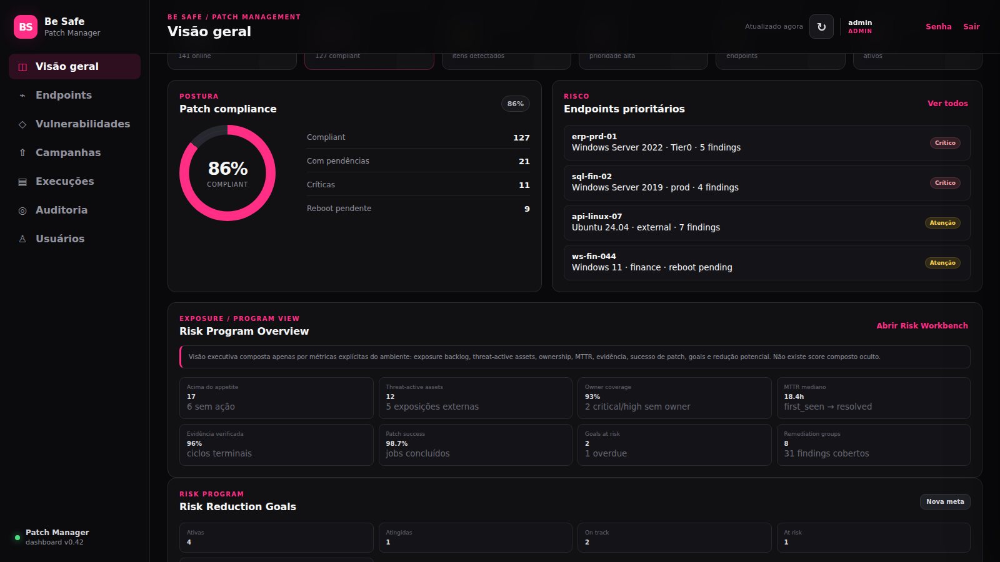
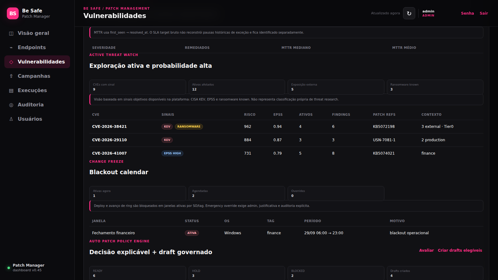
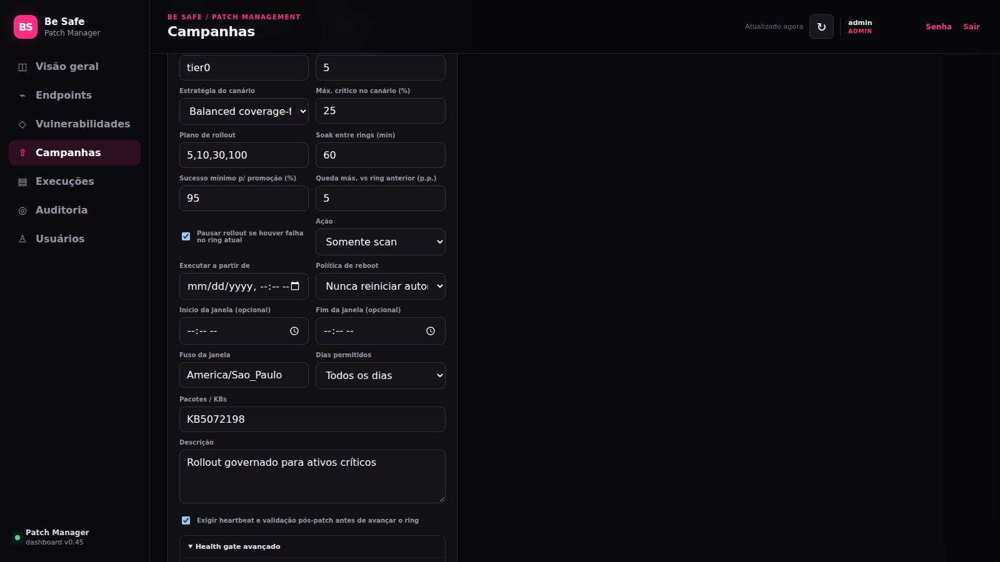
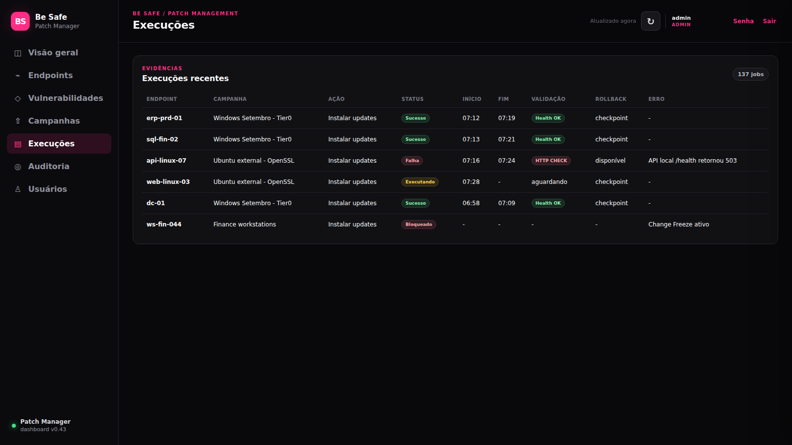
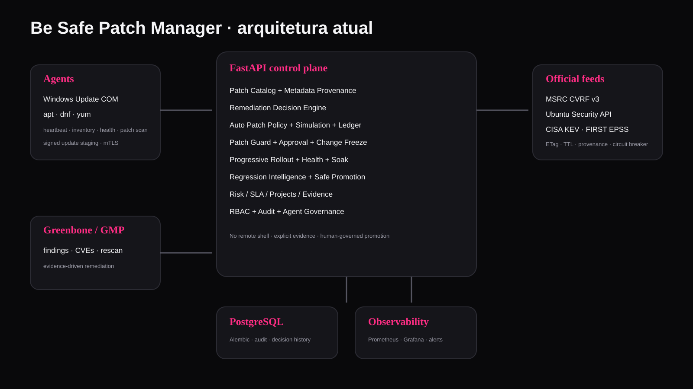

# Be Safe Patch Manager

<p align="center">
  
</p>

<p align="center"><strong>Be Safe Patch Manager</strong></p>

Patch management **agent-based para Windows e Linux** com inventário, patch intelligence, priorização por risco, campanhas governadas, rollout progressivo, health gates, soak, regression intelligence, rollback protegido e evidência operacional.

> **Status:** MVP / laboratório.  
> **Control plane:** v0.58.0  
> **Agente:** v0.16.0  
> A base já executa patching real, mas ainda exige validação em laboratório antes de uso em produção.



> As capturas deste README são geradas automaticamente a partir do front-end atual da `main`, com dados demonstrativos apenas para preencher a interface. Assim, menu, componentes, formulários, labels e estilos acompanham o produto real.

## Exposure Hotspots / concentração por endpoint

O relatório `GET /api/admin/reports/vulnerability-exposure-hotspots?limit=20` e o botão **Exposure Hotspots** do dashboard mostram onde estão concentrados os findings abertos. A ordenação é explícita: quantidade de críticos, altos, findings há mais de 90/30 dias e horas-finding observadas, com desempate pelo ID do agente. Não há score oculto.

A coleta lê somente as colunas necessárias dos findings e carrega dados de host apenas para os endpoints selecionados. O número de consultas não aumenta com cada finding. O limite de retorno é de 1 a 100 endpoints, mantendo os findings não correlacionados em um grupo agregado separado, sem inventar associação por hostname/IP. A unidade de exposição é finding-hours, não ativos ou CVEs distintos.

### Exportação CSV dos hotspots

O botão **Exportar Hotspots CSV** consulta o mesmo relatório autenticado, solicitando até **100 endpoints** (limite da API). O CSV UTF-8 contém data/hora da observação, ID/hostname, contagens explícitas, horas-finding e totais agregados de findings sem agente e timestamps inválidos. A exportação mantém a ordenação retornada pelo servidor e inclui uma linha de resumo quando não houver endpoints correlacionados.

**Escopo:** os 100 endpoints são somente os primeiros do ranking; os totais agregados continuam refletindo todos os findings abertos analisados. Não é um inventário completo nem uma comprovação de remediação. Campos de texto são protegidos contra execução de fórmulas ao abrir o CSV em planilhas. O teste `node --test scripts/test-exposure-hotspots-export.cjs` integra o CI.

### Triagem operacional dos hotspots

O botão **Triagem operacional** cruza, em modo somente leitura, os até 100 endpoints do relatório autenticado de exposição com o inventário de agentes já carregado no console, usando **exclusivamente o ID do agente** (nunca coincidência de hostname/IP). Mostra disponibilidade aproximada do heartbeat (janela de 15 minutos), pendências de patch informadas pelo agente e reboot, com botão **Abrir endpoint** apenas se houver uma identidade correspondente no inventário carregado.

Findings sem agente e datas inválidas permanecem visíveis; IDs de relatório ausentes no inventário são explicitamente sinalizados para reconciliação. Dados de patch são independentes das vulnerabilidades e não demonstram que uma atualização específica corrige um finding. Essa visão não executa patches, não cria campanhas e não atribui pontuações artificiais. Testes: `node --test scripts/test-exposure-triage.cjs`.

## Observed Exposure Time

O console inclui **Exposure Time** no Risk Program Overview. O endpoint `GET /api/admin/reports/vulnerability-exposure` fornece duração observada agregada por severidade e estado, incluindo findings abertos por mais de 30/90 dias, findings corrigidos com `resolved_at` e exposições abertas sem correlação com agente.

A leitura utiliza projeção de colunas e processamento incremental (`yield_per(1000)`), sem carregar relacionamentos ORM de cada finding. Os indicadores são expressos em **finding-hours**, não representam quantidade de ativos/CVEs únicos e **não** reconstroem períodos sem observação ou múltiplos ciclos de reabertura. Aceitação de risco não equivale a correção. Não há novo agente nem deploy automático.

## Tenant Localization

O console possui configuração de idioma persistente por tenant com três locales suportados:

- `pt-BR` — Português (Brasil);
- `en` — English;
- `es` — Español.

O idioma padrão é `pt-BR`.

O endpoint público `GET /api/tenant` fornece o locale padrão antes da autenticação. Administradores podem persistir a preferência do tenant por `PUT /api/admin/tenant`, e toda alteração é registrada no audit trail.

O seletor no topo também permite preview local para usuários não administradores sem alterar a configuração global do tenant.

A camada de i18n traduz o shell, navegação, autenticação, estados e os fluxos principais, com fallback seguro para PT-BR quando uma string ainda não possui tradução específica.

## Visão geral

O Be Safe Patch Manager não foi desenhado como um simples "listar updates e clicar em instalar".

A plataforma conecta:

- inventário e heartbeat dos endpoints;
- scan de patches;
- vulnerability management;
- threat intelligence;
- Patch Catalog;
- risk-based remediation;
- Auto Patch Policy;
- Patch Guard;
- Approval Gate;
- Change Freeze;
- rollout por rings;
- health gate;
- soak;
- regression intelligence;
- rollback;
- Campaign Preflight / Change Readiness;
- evidência pós-patch;
- auditoria.

O objetivo é responder não só **"qual patch está faltando?"**, mas também:

- em quais ativos;
- com qual contexto de risco;
- se a patch é realmente a melhor versão a implantar;
- qual blast radius inicial;
- se existe bloqueio operacional;
- se o ring atual piorou comparado ao anterior;
- por que promover, esperar ou pausar.

## Principais capacidades

### Patch Intelligence

O Patch Catalog consolida patches observadas pelos agentes e mantém:

- `missing`, `installed_inferred` e `no_longer_reported`;
- vendor e produto;
- release date;
- classificação;
- EOL;
- CVEs relacionadas;
- Patch Confidence;
- Patch Guard;
- deployment readiness;
- provenance campo a campo;
- metadata stale;
- supersedence graph;
- preferred replacement;
- Patch Tuesday intelligence.

A metadata pode vir de:

- feed `curated`;
- Microsoft Security Update Guide / CVRF v3;
- Ubuntu Security API.

O Patch Feed Orchestrator mantém:

- prioridade por provider;
- TTL;
- scheduling;
- ETag / Last-Modified;
- último sucesso/erro;
- failure counter;
- circuit breaker;
- sync manual e automático.

## Auto Patch Policy Engine



Policies podem operar em:

- `recommend`;
- `draft`.

Nesta versão **não existe auto-deploy**.

Uma policy pode considerar:

- KEV;
- exposição externa;
- Patch Tuesday;
- OS;
- tag;
- quantidade mínima de endpoints;
- confidence mínima;
- EOL;
- supersedence.

Regras importantes:

- **KEV + external** pode forçar canary de até 5%;
- Patch Tuesday pode limitar o rollout inicial a 10%;
- confidence abaixo do floor gera `HOLD`;
- EOL é bloqueado por padrão;
- patch superseded pode ser `replace`, `skip` ou `allow`;
- replacement só é usado quando a leaf está observada como aplicável/missing;
- Patch Guard e Change Freeze bloqueiam antes do draft;
- Approval Gate, Health Gate e rollback são herdados pela campanha.

### Simulation

A simulação mostra o funil real do escopo:

```text
missing total
  -> excluídos por OS
  -> excluídos por tag
  -> excluídos por exposição
  -> selecionados
```

Também expõe:

- blast radius;
- quantidade real do ring inicial;
- preconditions;
- confidence;
- EOL;
- KEV;
- motivo da decisão.

### Decision Ledger

Cada avaliação explícita gera um snapshot imutável com:

- ator;
- timestamp;
- modo;
- policies avaliadas;
- decisões;
- ready;
- blocked;
- holds;
- drafts criados;
- razões daquele momento.

Assim o histórico consegue responder:

> por que esta patch estava READY ontem?

sem recalcular a resposta com os dados de hoje.

## Console de governança de exceções

O console exibe painéis de **Exception Governance** e **Exception Budget** junto às políticas automáticas. O operador pode consultar exceções ativas, aprovações pendentes, vencimentos nas próximas 24 horas, histórico de policies mais excepcionadas e consumo mensal por orçamento.

Administradores podem cadastrar novos orçamentos por owner ou business service e realizar a segunda aprovação de waivers pendentes diretamente no console. A API continua aplicando RBAC e validações, independentemente dos controles do navegador.

## Integridade e desempenho das exceções

Os relatórios de governança carregam nomes de policies em lote, evitando consultas N+1 conforme cresce o número de waivers. Os testes de desempenho verificam limites de consultas com múltiplos budgets e dezenas de exceções. A decisão de escalonamento compara horas **sem arredondamento**, mesmo quando o painel apresenta apenas duas casas decimais.

## Exception Debt / histórico e escalabilidade

Relatórios de Exception Budget agora reutilizam **uma única coleta de waivers** por janela e carregam os serviços das campanhas em lote; o número de consultas não cresce com o número de budgets. O cálculo usa a duração exata (sem arredondamento) para decidir escalonamento.

`GET /api/admin/reports/exception-budget-trend?months=6` retorna até 12 meses de histórico por orçamento: quantidade mensal, horas mensais, utilização e reincidência (`recurring` quando há exceções em 2 ou mais meses). Os dados históricos seguem o critério explícito de **mês de criação do waiver** e desconsideram waivers revogados; não são uma contagem de horas efetivamente transcorridas.

## Exception Budget / Risk Budget

A v0.58 adiciona orçamento mensal de exceções por `owner` ou `business_service`.

Cada budget define:

- máximo de waivers no mês;
- máximo de horas de waiver no mês;
- estado `healthy`, `warning` (>=80%) ou `exhausted`.

Antes de criar um waiver, o sistema calcula o consumo atual e o consumo projetado. Se o novo pedido ultrapassar quantidade ou horas disponíveis, o waiver é automaticamente escalado para **dual approval**, mesmo em campanha não crítica.

Endpoints:

- `GET /api/admin/exception-budgets`
- `POST /api/admin/exception-budgets`
- `PATCH /api/admin/exception-budgets/{id}`
- `GET /api/admin/reports/exception-budgets`

O cálculo é determinístico e mensal, preservando a governança sem transformar budget em bypass silencioso.

## Exception Governance

A v0.57 adiciona governança sobre as próprias exceções:

- waiver de campanha normal: 1 admin;
- waiver quando o escopo contém Tier 0 ou criticidade >=4: **2 admins distintos**;
- owner obrigatório da exceção;
- máximo de 3 waivers ativos por campanha;
- waiver pendente não suprime enforcement;
- alerta lógico de expiração em até 24h;
- relatório `/api/admin/reports/policy-waiver-governance`;
- ranking de policies mais excepcionadas e owners com mais waivers;
- relatório separa active, pending, expired e revoked.

A segunda aprovação também é auditada. O solicitante não pode ser o segundo aprovador.

## Policy Exceptions / Waivers

A v0.56 adiciona exceções temporárias sem apagar a evidência da violação.

Um waiver:

- é vinculado à campanha e à **versão exata da policy por SHA-256**;
- exige aprovação de admin e motivo mínimo;
- possui expiração obrigatória, limitada a 30 dias;
- não remove a violação do relatório: ela permanece marcada como `waived`;
- deixa de valer automaticamente ao expirar;
- pode ser revogado antes do prazo, com motivo e auditoria;
- não sobrevive silenciosamente a uma nova versão da policy, porque o digest muda;
- entra no Evidence Pack com criação, expiração e eventual revogação.

O Preflight só deixa de bloquear quando todas as violações restantes estão cobertas por waivers ativos e vinculados à policy exata.

## Policy Bundles / GitOps

A v0.55 torna o Policy-as-Code transportável entre ambientes e adequado a GitOps.

O endpoint `GET /api/admin/patch-policies/bundle/export` exporta somente a versão mais recente de cada policy em um bundle `be-safe-patch-policy-bundle/v1`, contendo:

- versão, prioridade e estado enabled;
- documento normalizado;
- SHA-256 individual de cada policy;
- manifest com SHA-256 do bundle completo.

Antes de importar, `POST /api/admin/patch-policies/bundle/dry-run` valida todos os hashes e compara o bundle proposto com até 500 campanhas existentes, classificando impacto como `newly_blocked`, `resolved`, `still_blocked` ou `still_compliant`.

O import é transacional no sentido de validação: nenhum registro é alterado antes de o bundle inteiro ser validado. Policies modificadas criam **nova versão local**; versões anteriores permanecem na cadeia e são desabilitadas. Policies idênticas ficam `unchanged`.

Isso permite manter o JSON exportado em Git, revisar mudanças por pull request e executar dry-run antes de promover uma policy para outro ambiente.

## Patch Policy-as-Code

A v0.54 adiciona políticas de execução versionadas no schema `be-safe-patch-policy/v1`.

Cada policy possui versão imutável, SHA-256, prioridade, autor e cadeia `supersedes_id`. Uma nova versão desativa a anterior, preservando histórico e auditabilidade.

O documento separa:

- `match`: action, SO, tags, ambientes e criticidade mínima;
- `requirements`: ring inicial máximo, health gate, rollback, janela e quorum mínimo de aprovação.

O Preflight avalia apenas a versão habilitada mais recente de cada policy. Violações bloqueiam deploy e entram no Evidence Pack.

Também há simulação sem persistência via `POST /api/admin/patch-policies/simulate`, permitindo testar uma regra contra uma campanha antes de publicá-la.

Exemplo:

```json
{
  "schema": "be-safe-patch-policy/v1",
  "description": "Tier 0 production",
  "match": {
    "actions": ["install_updates"],
    "target_os": ["windows"],
    "tags_any": ["tier0"],
    "environments": ["production"],
    "min_criticality": 4
  },
  "requirements": {
    "max_initial_ring_percent": 5,
    "require_health_gate": true,
    "require_rollback": true,
    "require_maintenance_window": true,
    "min_approvals": 2
  }
}
```

## Explainable Change Risk Engine

A v0.53 adiciona um engine determinístico para risco operacional de mudança.

O score de 0–100 é composto por fatores visíveis e auditáveis, como:

- ativos críticos e exposição externa;
- concentração do blast radius;
- colisão com mudanças concorrentes;
- reboot em ativos críticos;
- applicability/supersedence incerta ou bloqueada;
- regressão e failure rate observados localmente;
- ausência de health gate, rollback ou janela;
- tamanho do ring inicial.

Faixas: LOW, MODERATE, HIGH e CRITICAL.

O engine **não mistura risco da vulnerabilidade com risco da mudança**. CISA KEV, ransomware e EPSS aparecem como contexto de urgência, mas não aumentam artificialmente o score operacional.

Mudanças CRITICAL exigem controles mínimos objetivos. Se health gate, rollback, ring inicial ≤10% ou janela obrigatória estiverem ausentes, o Preflight bloqueia a implantação e mostra exatamente qual controle falta.

O endpoint `/api/admin/campaigns/{id}/change-risk` e o botão **Change Risk** exibem fatores, pontos, fontes e controles requeridos. O mesmo snapshot entra no Evidence Pack.

## CAB / Change Authority

O Approval Gate evoluiu para uma camada explícita de **Change Authority**.

Regras padrão:

- campanhas comuns continuam sem aprovação, salvo quando a política ou operador exigir;
- quando aprovação é exigida em escopo normal, é necessária 1 aprovação administrativa;
- campanhas de instalação que atinjam ativo com criticidade 4–5 ou tag Tier 0 exigem automaticamente **2 aprovadores distintos**;
- o solicitante da campanha não pode aprovar nem rejeitar a própria mudança;
- o mesmo ator não pode votar duas vezes;
- qualquer rejeição encerra o gate como `rejected`;
- cada voto guarda ator, decisão, motivo e timestamp;
- o Preflight mostra `aprovadas / necessárias` e bloqueia enquanto o quorum não for atingido.

A decisão de exigir dupla aprovação é baseada em regras visíveis do escopo, não em score oculto.

## Campaign Preflight / Change Readiness

Antes do deploy, a console pode executar um preflight explicável da campanha.

O checklist consolida em um único lugar:

- população total e tamanho real do ring inicial;
- Approval Gate;
- Change Freeze e emergency override;
- Patch Guard;
- versão, protocolo e capabilities do agente;
- heartbeat freshness;
- mTLS quando obrigatório;
- maintenance window;
- Patch Confidence local.

O resultado é:

- `READY`: nenhum bloqueio ou alerta;
- `REVIEW`: deploy permitido, mas há alertas que merecem revisão humana;
- `BLOCKED`: existe pelo menos um gate impeditivo.

Não existe score oculto de readiness. Cada decisão traz o controle, o estado e a razão concreta.

## Preflight Evidence + Drift Detection

O Preflight pode ser registrado como evidência imutável antes de uma mudança.

Cada snapshot persiste:

- readiness;
- deploy allowed/blocked;
- resumo dos checks;
- resultado completo;
- ator;
- origem;
- timestamp;
- SHA-256 do conteúdo.

A console compara o estado atual com o último snapshot e mostra drift explícito:

- `NO_BASELINE`;
- `UNCHANGED`;
- `IMPROVED`;
- `CHANGED`;
- `DEGRADED`.

O diff identifica exatamente quais controles mudaram, por exemplo:

```text
Agent freshness   PASSED  -> WARNING
Patch Guard       PASSED  -> BLOCKED
```

Toda tentativa de deploy também registra automaticamente um snapshot de preflight, preservando a evidência da condição operacional observada naquele momento.

## Scope Drift Guard

Toda campanha nova captura um baseline de escopo no momento da criação.

O baseline registra, por endpoint:

- agent id e hostname;
- SO e versão;
- tags;
- business service;
- environment;
- owner;
- criticidade;
- exposição externa.

Também grava SHA-256 do snapshot.

Antes do deploy, o guard compara esse baseline com o escopo atual.

Regras:

```text
endpoint entrou no escopo após a criação
OU
endpoint saiu do escopo após a criação
=> BLOCKED

membership estável,
mas contexto operacional mudou
=> WARNING

membership + contexto comparado estáveis
=> PASSED
```

Exemplos de context drift:

- owner alterado;
- business service alterado;
- environment alterado;
- criticidade mudou;
- exposição externa mudou;
- versão de SO mudou;
- tags mudaram.

Campanhas anteriores à v0.49 não são bloqueadas: aparecem como `no_baseline` e exigem revisão humana.

O console ganha a ação `Scope Drift`, o Preflight inclui `Scope Drift Guard`, e o Evidence Pack passa a incluir `scope_drift` com SHA-256 próprio.

## Maintenance Risk & Reboot Orchestration

Antes do deploy, a campanha calcula um plano explicável de manutenção e reboot usando evidência real do ambiente.

A análise cruza:

- reboot já pendente no endpoint;
- metadata `reboot_behavior` do Patch Catalog;
- applicability `missing` por endpoint;
- criticidade e business context dos ativos;
- critical services configurados no Health Gate;
- reboot policy efetiva da campanha;
- janela de manutenção;
- duração histórica observada de jobs comparáveis.

Estados:

- `ready`;
- `observe`;
- `review`;
- `blocked`;
- `not_applicable`.

Regra impeditiva explícita:

```text
patch missing exige reboot
+
campanha proíbe reboot
=> BLOCKED
```

Outros sinais são advisory e explicáveis:

- endpoint já com reboot pendente;
- ativo crítico com reboot pendente ou provável;
- serviço crítico em mudança com potencial de reboot;
- metadata de reboot desconhecida;
- janela menor que o p95 observado quando existem pelo menos 3 jobs comparáveis.

O histórico mostra mediana e p95 de duração apenas quando existe amostra observada. A plataforma não inventa duração estimada quando não há dados suficientes.

O console ganha a ação `Reboot Plan`, o Preflight inclui `Maintenance & Reboot Readiness`, e o Evidence Pack passa a incluir `maintenance_risk` com SHA-256 próprio.

## Patch Applicability & Supersedence Guard

Antes do deploy, a campanha cruza os pacotes com o Patch Catalog e a applicability observada nos endpoints reais do ring.

O guard usa apenas evidência local explícita:

- catálogo da patch;
- lifecycle/EOL;
- grafo de supersedence;
- replacement leaf conhecido;
- status de applicability por agente;
- metadata/enrichment freshness.

Regras principais:

```text
superseded + replacement leaf conhecido
=> BLOCKED

todos os endpoints do ring observados
e nenhum reporta status missing
=> BLOCKED

EOL
=> WARNING

metadata stale
=> WARNING

applicability parcial ou ausente
=> WARNING
```

A plataforma não infere compatibilidade quando não existe evidência.

Para cada patch, o relatório mostra:

- endpoints selecionados;
- endpoints observados;
- quantos reportam `missing`;
- quantos estão `installed_inferred`;
- quantos estão `no_longer_reported`;
- quantos não possuem observação;
- superseded_by;
- preferred replacement;
- lifecycle;
- motivos exatos da decisão.

O Preflight inclui o check `Patch Applicability & Supersedence`, o console possui uma ação `Applicability`, e o Evidence Pack inclui a seção `patch_applicability` com SHA-256 próprio.

## Change Collision Guard

Antes do deploy, a plataforma verifica se o ring entra em conflito com outras mudanças ainda ativas.

O guard cruza os endpoints do ring com jobs não terminais de outras campanhas:

- `pending`;
- `claimed`;
- `running`;
- `stalled`;
- `blocked`.

Regras:

```text
direct_asset_collision
=> o mesmo endpoint já possui job não terminal em outra campanha
=> BLOCKED

context_collision
=> o ring compartilha business service + environment
   com jobs ativos de outra campanha
=> WARNING

owner_collision
=> o ring compartilha owner com outra mudança ativa
=> WARNING
```

A colisão direta bloqueia o deploy porque duas campanhas concorrentes no mesmo endpoint criariam uma condição operacional objetiva de conflito.

Colisões apenas de contexto são advisory: a ferramenta mostra as campanhas, jobs, services, environments e owners envolvidos, mas não inventa uma regra corporativa de CAB.

O console possui uma ação `Collision Guard` por campanha e o Preflight inclui o check `Change Collision Guard`.

O Evidence Pack registra a seção `change_collisions` com SHA-256 próprio.

## Smart Canary / Adaptive Ring Planner

Campanhas novas usam, por padrão, um canário determinístico `balanced` em vez de depender apenas do hash dos endpoints.

A seleção é **coverage-first** e não usa score composto oculto.

Para cada vaga do ring, a plataforma avalia lexicograficamente:

1. manter ativos críticos abaixo do teto configurado, quando existir alternativa não crítica;
2. escolher o business service menos representado;
3. escolher o environment menos representado;
4. escolher o segmento de SO/versão menos representado;
5. escolher o owner menos representado;
6. usar o hash estável do agent somente como desempate final.

Parâmetros configuráveis por campanha:

- `ring_strategy = balanced | hash`;
- `canary_max_critical_percent`.

O modo `hash` preserva o comportamento legado.

O modo `balanced` é determinístico: o mesmo conjunto de endpoints e contexto produz a mesma seleção e a mesma ordem.

O console exibe:

- quantidade selecionada;
- cobertura de business services;
- environments;
- segmentos de SO;
- owners;
- quantidade de críticos no canário;
- teto configurado;
- ordem determinística dos endpoints;
- regras utilizadas.

O Preflight registra um check `Smart Canary` e o Evidence Pack inclui o `ring_plan` completo com SHA-256 próprio.

## Blast Radius Intelligence

Antes do deploy, a campanha calcula o impacto operacional real do ring usando o contexto que já existe no Asset Risk.

O Change Impact Preview mostra:

- tamanho total do escopo;
- quantidade real do ring;
- percentual do escopo atingido;
- ativos com criticidade 4–5;
- ativos com exposição externa;
- ativos acima do risk appetite;
- ativos críticos sem owner;
- quantidade de business services, owners e environments;
- Asset Risk médio e máximo;
- maior concentração por business service;
- distribuição por business service, owner e environment;
- lista dos ativos mais sensíveis do ring.

Estados possíveis:

- `contained`;
- `concentrated`;
- `critical_scope`.

As regras são explícitas:

```text
critical asset
=> criticality >= 4

service concentration
=> mesmo business service >= 50% de um ring com >= 3 assets

critical_scope
=> ativo crítico sem owner
   OU
=> ativos críticos presentes e ring >= 50% do escopo total
```

O Blast Radius não cria score composto oculto. Ele reutiliza criticidade, exposição, risk appetite e Business Context já existentes.

Quando o impacto é concentrado ou crítico, o Preflight gera warning explicável. Por padrão isso não bloqueia o deploy: a intenção é dar contexto humano antes da mudança, não inventar uma política que o cliente não configurou.

O Evidence Pack também passa a incluir o snapshot completo de Blast Radius.

## Patch Failure Intelligence

A plataforma aprende com o histórico local de deployment em vez de tratar toda falha como um evento isolado.

A análise agrupa evidências por:

- patch reference;
- sistema operacional;
- versão do sistema operacional;
- categoria da falha;
- assinatura normalizada do erro.

Categorias operacionais incluem:

- `install_failure`;
- `download_or_network`;
- `dependency_or_prerequisite`;
- `reboot_required`;
- `disk_capacity`;
- `permission`;
- `applicability_or_compatibility`;
- `execution_stalled`;
- `compatibility_blocked`;
- `post_patch_regression`;
- `rollback_failure`.

A normalização remove valores voláteis como URL, códigos hexadecimais e números longos para agrupar ocorrências equivalentes sem fingir uma causa-raiz que não foi observada.

Estados por patch + SO/versão:

- `stable`;
- `observed_failures`;
- `elevated_failure_rate`;
- `confirmed_local_regression`.

Uma regressão local confirmada exige, na janela de 30 dias:

```text
>= 3 resultados comparáveis
>= 2 falhas efetivas
>= 50% de taxa de falha efetiva
```

Falha efetiva considera falha de instalação e regressão pós-patch observada pelo Health Gate.

O Campaign Preflight cruza automaticamente a patch da campanha com o SO/versão real do ring. Quando existe regressão local confirmada exatamente nesse segmento, o deploy é bloqueado antes da criação de jobs.

Uma falha isolada não gera bloqueio.

## Campaign Evidence Pack

Cada campanha pode ser exportada como um pacote único de evidências em JSON.

O pack inclui:

- estado e configuração da campanha;
- Approval Gate;
- todos os snapshots de Preflight;
- decisões de rings;
- jobs e resultados;
- Health Gate e validação pós-patch;
- rollback state;
- remediation evidence vinculada ao job;
- emergency freeze override, quando houver;
- eventos de auditoria da campanha e dos jobs.

A exportação possui um manifest verificável com:

- `schema`;
- SHA-256 do pacote;
- SHA-256 individual de cada seção;
- algoritmo e instrução de verificação.

Os hashes usam JSON UTF-8 canonicalizado com chaves ordenadas e separadores compactos.

Isso permite detectar alteração em qualquer parte da evidência exportada sem depender de um score ou interpretação proprietária.

### Evidence Pack Integrity Verifier

A console também valida Evidence Packs já exportados. O fluxo recalcula:

- SHA-256 do pacote completo, sem o campo `manifest`;
- SHA-256 de cada seção;
- consistência entre `section_hashes` e o manifest;
- schema do pacote;
- vínculo com a campanha esperada.

Opcionalmente, o operador informa um **SHA-256 confiável registrado fora do próprio arquivo**. Essa âncora externa é importante porque hashes internos comprovam autoconsistência, mas não impedem que alguém altere o JSON e recalcule todos os hashes. Com uma cópia confiável do digest original, a plataforma detecta também esse cenário.

Cada validação feita pela API é registrada no audit trail com resultado, digest calculado e divergências encontradas.


### Signed Evidence Attestation

Opcionalmente, cada Evidence Pack pode receber uma **attestation Ed25519** no momento da exportação.

A assinatura vincula:

- produto;
- issuer;
- `campaign_id`;
- SHA-256 exato do Evidence Pack;
- timestamp de geração;
- `signing_key_id` derivado da chave pública confiável.

A chave de attestation é **separada** da chave usada para assinar releases do agente.

Quando `EVIDENCE_ATTESTATION_ENABLED=true`, a exportação opera em modo fail-closed: se a chave privada configurada estiver ausente ou inválida, o servidor recusa gerar um Evidence Pack aparentemente íntegro porém sem a assinatura esperada.

O console verifica a assinatura quando possui a chave pública confiável. Para auditoria independente, o repositório também inclui:

```bash
python scripts/verify-evidence-pack.py evidence-pack.json \
  --public-key evidence-attestation-public.pem \
  --expected-sha256 <digest-confiavel> \
  --campaign-id <campaign-id>
```

Assim, um auditor pode validar hashes, vínculo da campanha e assinatura Ed25519 **sem depender do servidor que produziu a evidência**.

Para gerar um par dedicado:

```bash
python scripts/evidence-attestation-key.py generate-key \
  --private-key deploy/evidence-trust/evidence-attestation-private.pem \
  --public-key deploy/evidence-trust/evidence-attestation-public.pem
```

## Progressive Rollout Governance



Cada campanha pode carregar um plano próprio, por exemplo:

```text
5 -> 10 -> 30 -> 100
```

ou:

```text
10 -> 25 -> 50 -> 100
```

Parâmetros:

- `rollout_plan`;
- `soak_minutes`;
- `promotion_min_success_rate`;
- `promotion_max_success_drop`;
- `pause_on_failure`.

Estados possíveis:

- `DRAFT`;
- `RUNNING`;
- `SOAK`;
- `PROMOTE`;
- `PAUSE`;
- `COMPLETE`.

Se o plano foi explicitamente configurado, o próximo ring é governado por ele.

Campanhas antigas sem plano explícito continuam compatíveis com o comportamento legado.

## Regression Intelligence + Safe Promotion

O health gate responde:

> este ring está saudável isoladamente?

A Regression Intelligence responde:

> este ring piorou em relação ao ring anterior?

A comparação usa evidências reais do rollout:

- success rate;
- failure rate;
- falhas de validação pós-patch;
- duração média dos jobs observados.

Estados:

- `NO_BASELINE`;
- `STABLE`;
- `REGRESSION`.

A recomendação de Safe Promotion pode ser:

- `PROMOTE`;
- `PAUSE`;
- `WAIT`;
- `COMPLETE`;
- `REVIEW`.

Exemplo:

```text
ring anterior: 100% success
ring atual:     91% success
mínimo absoluto: 90%
queda permitida: 5 p.p.

queda observada: 9 p.p.
=> REGRESSION
=> PAUSE
```

Mesmo que o threshold absoluto ainda esteja atendido, a deterioração relativa pode impedir promoção.

Cada deploy inicial e cada promoção de ring ficam registrados com:

- ator;
- ring anterior;
- ring seguinte;
- decisão;
- motivo;
- snapshot do health gate;
- timestamp.

## Risk-Based Remediation


A camada de risco inclui:

- CVSS;
- EPSS;
- CISA KEV;
- ransomware known;
- idade;
- SLA;
- criticidade;
- exposição externa;
- controles compensatórios;
- risk appetite;
- owner;
- business service;
- environment.

A plataforma mantém:

- Finding Risk explicável;
- Asset Risk 0–1000;
- histórico de Asset Risk;
- Risk Acceptance;
- Treatment Plan;
- Risk Reduction Simulation;
- Risk Reduction Opportunities;
- Risk Reduction Plan;
- Risk Reduction Goals;
- Remediation Hub;
- Remediation Projects;
- Active Threat Watch;
- Remediation Performance;
- Risk Program Overview.

Não existe score composto oculto para decidir promoção de patch.

A referência completa do modelo de risco está em [docs/risk-model.md](docs/risk-model.md).

## Execuções, Health Gate e Rollback



O agente pode coletar baseline imediatamente antes do patch e comparar depois:

- CPU;
- memória;
- espaço livre em disco;
- serviços críticos;
- checks HTTP(S) locais.

O health gate pode operar em modo fail-closed quando telemetria é obrigatória.

Rollback:

- checkpoint antes do patch, quando suportado;
- aprovação manual;
- motivo obrigatório;
- novo job auditável;
- sem rollback silencioso.

## Change Governance

### Patch Guard

Bloqueia uma patch reference:

- globalmente;
- por SO;
- por tag.

Deploy e avanço de ring falham antes de criar jobs quando uma regra ativa casa com o escopo.

### Approval Gate

Campanhas podem exigir aprovação administrativa.

Existe segregação de função:

> quem solicitou a campanha protegida não pode aprovar a própria mudança.

### Change Freeze / Blackout Calendar

Bloqueia deploy e promoção dentro de janelas ativas.

Emergency override:

- exige admin;
- exige justificativa;
- é específico da campanha;
- pode ser revogado;
- fica auditado.

## Arquitetura



Componentes principais:

- FastAPI;
- PostgreSQL;
- Alembic;
- agente Python;
- NGINX;
- Prometheus;
- Grafana;
- Greenbone/GMP opcional;
- feeds oficiais Microsoft/Ubuntu;
- CISA KEV;
- FIRST EPSS.

O Docker Compose usa PostgreSQL por padrão.

SQLite continua disponível para desenvolvimento/testes.

## Agentes

### Windows

- Windows Update Agent via COM;
- patch scan;
- instalação de updates;
- health telemetry;
- rollback checkpoint quando suportado;
- staging assinado de update do próprio agente.

### Linux

- `apt`;
- `dnf`;
- `yum`;
- patch scan;
- instalação;
- health telemetry;
- ativação segura de agent release assinada.

Cada agente reporta:

- versão;
- protocolo;
- capabilities;
- inventário;
- patches;
- heartbeat;
- estado de update;
- capacidade de rollback.

Ações em allowlist:

- `scan_updates`;
- `install_updates`;
- `rollback_checkpoint`;
- `activate_agent_update`.

**Não existe shell remoto arbitrário.**

## Quick start

### Servidor

Pré-requisitos:

- Docker;
- Docker Compose.

```bash
cp .env.example .env
```

Gere segredos fortes:

```bash
python3 - <<'PY'
import secrets
print("BOOTSTRAP_ADMIN_PASSWORD=" + secrets.token_urlsafe(32))
print("ENROLLMENT_TOKEN=" + secrets.token_urlsafe(48))
print("POSTGRES_PASSWORD=" + secrets.token_urlsafe(48))
PY
```

Defina também:

```dotenv
BOOTSTRAP_ADMIN_USERNAME=admin
```

Laboratório:

```bash
docker compose up -d --build
docker compose ps
```

Backend local:

```text
http://127.0.0.1:8080
```

Produção com HTTPS/mTLS:

```bash
docker compose -f docker-compose.yml -f docker-compose.prod.yml up -d --build
```

### Agente Linux

```bash
sudo ./deploy/install-linux.sh https://patch.seudominio.local piloto
```

### Agente Windows

PowerShell como Administrador:

```powershell
Set-ExecutionPolicy -Scope Process Bypass

.\deploy\windows\install-agent.ps1 `
  -ServerUrl "https://patch.seudominio.local" `
  -Tags @("piloto")
```

## Autenticação e RBAC

Perfis:

- `viewer`: leitura;
- `operator`: operação de campanhas, tags, vulnerabilidades, sync e avaliações;
- `admin`: usuários, approvals, rollback, retries e controles administrativos.

Senhas usam Argon2.

Sessões humanas:

- opacas;
- server-side;
- token armazenado somente em hash;
- mantidas somente em memória no navegador.

## Segurança

Já implementado:

- RBAC;
- Argon2;
- credencial individual por agente;
- enrollment token descartado após registro;
- allowlist de ações;
- job lease;
- claim token efêmero;
- resultados idempotentes;
- retry manual de jobs `stalled`;
- HTTPS;
- mTLS no overlay de produção;
- fingerprint vinculado ao agent_id;
- Patch Guard;
- Approval Gate;
- Change Freeze;
- health gate;
- rollback approval;
- signed agent releases com Ed25519;
- SHA-256;
- anti-downgrade;
- quarantine após watchdog rollback;
- PostgreSQL;
- Alembic;
- audit trail;
- pre-publish security check.

Para produção ainda são recomendados:

- testes reais Windows/Linux;
- HA;
- storage off-host para backup;
- rate limiting;
- SSO/federação opcional;
- hardening do host;
- Authenticode/EV caso o agente seja empacotado como EXE/MSI.

Leia também [SECURITY.md](SECURITY.md).

## Self-update assinado do agente

A release do agente usa Ed25519.

A chave privada deve ficar offline, em HSM ou cofre de CI.

Gerar par:

```bash
python scripts/agent-release.py generate-key \
  --private-key /caminho-seguro/agent-update-private.pem \
  --public-key /caminho-seguro/agent-update-public.pem
```

Build:

```bash
python scripts/agent-release.py build \
  --private-key /caminho-seguro/agent-update-private.pem \
  --output releases \
  --version 0.16.0 \
  --source-commit "$(git rev-parse HEAD)"
```

Verify:

```bash
python scripts/agent-release.py verify \
  --public-key deploy/update-trust/agent-update-public.pem \
  --release-dir releases
```

A assinatura Ed25519 protege o pacote e o manifest do update.

Ela **não substitui Authenticode/EV Code Signing** de um EXE/MSI Windows.

## HTTPS e mTLS

Produção:

```bash
docker compose -f docker-compose.yml -f docker-compose.prod.yml up -d --build
```

Arquivos esperados fora do Git:

```text
deploy/nginx/tls/server.crt
deploy/nginx/tls/server.key
deploy/nginx/tls/agent-ca.crt
```

As rotas de agente exigem certificado cliente válido no overlay de produção.

## Backup e restore

Backup:

```bash
./scripts/backup-postgres.sh
```

Restore:

```bash
CONFIRM_RESTORE=YES ./scripts/restore-postgres.sh backups/patchmgr-YYYYMMDDTHHMMSSZ.dump
```

O CI executa restore drill real em PostgreSQL.

## Observabilidade

Endpoints:

```text
GET /health
GET /ready
GET /metrics
```

Arquivos:

```text
deploy/prometheus/scrape.example.yml
deploy/prometheus/patch-manager.rules.yml
deploy/grafana/patch-manager-overview.json
```

As métricas são agregadas e evitam labels de alta cardinalidade com hostname, IP, usuário ou CVE.

## CI

O pipeline valida:

- Python syntax;
- signed release drill;
- Alembic em PostgreSQL real;
- backup/restore drill;
- unit tests;
- Docker Compose;
- Shell;
- PowerShell;
- NGINX;
- Prometheus;
- Grafana;
- JavaScript;
- pre-publish security check.

A v0.46 passa pelo pipeline completo antes de ser considerada pronta.

## Estrutura

```text
be-safe-patch-manager/
├── docker-compose.yml
├── docker-compose.prod.yml
├── .env.example
├── README.md
├── SECURITY.md
├── CHANGELOG.md
├── docs/
│   ├── risk-model.md
│   └── images/
│       ├── dashboard-overview.svg
│       ├── dashboard-executions.svg
│       ├── auto-patch-policy.svg
│       ├── architecture-overview.svg
│       ├── secure-rollout-flow.svg
│       └── risk-reduction-features.svg
├── scripts/
├── releases/
├── server/
│   ├── alembic/
│   ├── tests/
│   └── app/
│       ├── main.py
│       ├── patch_feed_adapters.py
│       ├── observability.py
│       ├── agent_updates.py
│       ├── greenbone.py
│       ├── database.py
│       ├── models.py
│       ├── schemas.py
│       ├── security.py
│       └── static/
│           ├── index.html
│           ├── style.css
│           └── app.js
├── agent/
└── deploy/
```

## Roadmap

Próximas evoluções naturais:

- patching de aplicações de terceiros;
- ingestão adicional de CVEs;
- integração ITSM/SOAR;
- relatórios executivos e compliance exportáveis;
- testes de integração reais em endpoints Windows/Linux;
- ativação segura equivalente do agente no Windows;
- HA e recuperação completa periódica.

## Licença

Consulte [LICENSE](LICENSE).
