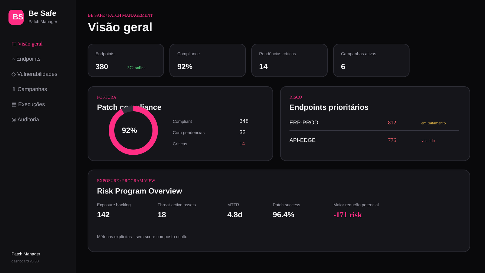
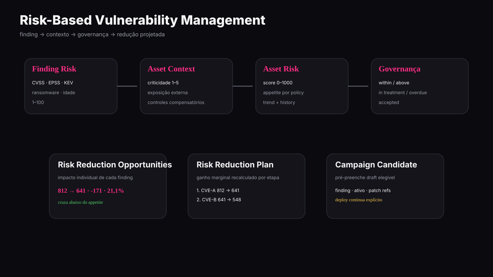
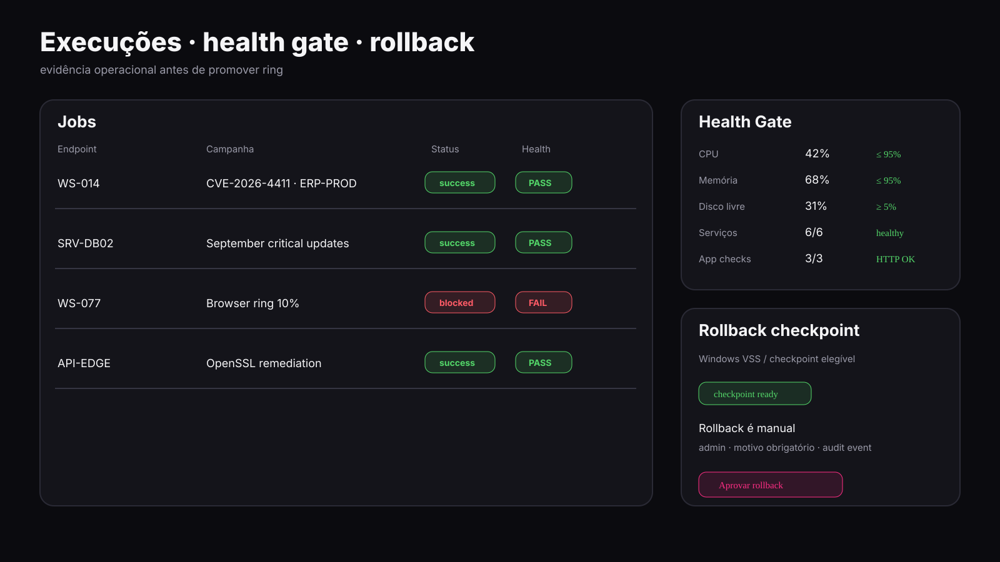
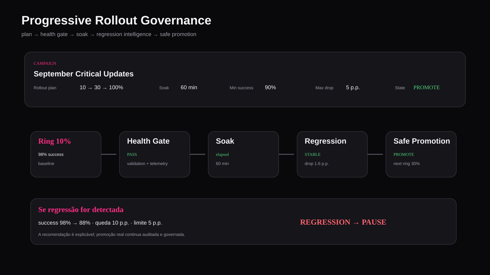

# Be Safe Patch Manager

Patch management **agent-based** para Windows e Linux, com inventário, campanhas, rollout progressivo, health gates, janelas de manutenção, evidências de execução e proteção de rollback.

> **Status:** MVP / laboratório. Control plane v0.20; agente v0.16. A base já executa patching real, mas ainda exige validação em laboratório antes de uso em produção.



## O que já funciona

- inventário e heartbeat de endpoints;
- scan de updates pendentes;
- dashboard de compliance, risco, endpoints, vulnerabilidades, campanhas, execuções e auditoria;
- ingestão normalizada de findings de scanners, começando por OpenVAS/Greenbone;
- correlação de finding por hostname/IP com endpoint gerenciado;
- CVE, severidade, CVSS, solução e referências de patch por finding;
- SLA de vulnerabilidades configurável por severidade, com estados `within_sla`, `due_soon` e `breached`;
- relatório consolidado de SLA em `GET /api/admin/reports/vulnerability-sla`;
- exceções temporárias de SLA com aprovação administrativa, motivo, expiração e revogação auditada;
- priorização contextual de vulnerabilidades com score explicável de 0–100 usando CVSS, EPSS/KEV quando disponíveis, idade e criticidade/exposição por tags do ativo;
- enriquecimento opcional automático de CVEs usando FIRST EPSS e o catálogo CISA KEV, com cache no finding e modo degradado quando apenas uma fonte responde;
- fila de remediação explicável que combina risco e SLA para recomendar patch imediato, agendamento, planejamento, triagem ou correlação de ativo, sem deploy automático;
- risco agregado por ativo em escala 0–1000, com criticidade 1–5, exposição externa, fatores compensatórios e risk appetite configurável;
- histórico persistente de Asset Risk com snapshots automáticos após syncs relevantes, delta de tendência e histórico consultável por endpoint;
- perfil de risco explícito por ativo, com override governado de criticidade, exposição e controles compensatórios; tags permanecem como fallback automático;
- risk appetite policies por tag/grupo, com prioridade, fallback global e auditoria; cada ativo pode ter um limite operacional diferente sem alterar seu score;
- aceitação temporária de risco por ativo, com motivo, aprovador, validade, revogação e auditoria; o score permanece intacto;
- Treatment Plan por ativo com owner, ação, prazo, estado, atraso e evidência de conclusão, separado formalmente de Risk Acceptance;
- estados executivos de governança por ativo: dentro do appetite, acima sem ação, em tratamento, tratamento vencido ou risco aceito;
- Risk Reduction Simulation por finding, mostrando score atual, score projetado, delta e impacto sobre o appetite sem alterar evidência ou estado real;
- ranking de Risk Reduction Opportunities para priorizar findings pela redução projetada de Asset Risk, sem somar deltas independentes;
- Risk Reduction Plan por ativo, recalculando ganho marginal passo a passo até atingir o appetite ou o limite de etapas;
- histórico auditável de Asset Risk com model version, decomposition, cálculo intermediário, policy/appetite e estado de governança persistidos por snapshot;
- timeline por ativo na console, mostrando evolução de score, appetite/policy, governança e versão do modelo ao longo do tempo;
- Remediation Hub por patch/action com impacto agregado recalculado por ativo;
- Active Threat Watch baseado em CISA KEV, EPSS e ransomware known;
- Patch Confidence a partir do histórico local de deploys;
- Asset Accountability com owner, business service e environment;
- Business Context Segments e Remediation Performance com MTTR, evidência e patch success;
- etapas elegíveis do plano podem pré-preencher um draft de campanha, mantendo criação e deploy sob controle explícito do operador;
- criação de campanha a partir de finding correlacionado;
- evidência de remediação vinculando finding, campanha, job e endpoint;
- rescan Greenbone automático após patch validado;
- reconciliação pelo report exato retornado pelo `start_task()`;
- prova por combinação `external_id + CVE`;
- estado `verified` somente após report pós-patch concluído sem a CVE;
- estado `still_detected` quando o rescan confirma persistência da vulnerabilidade;
- novo rescan manual auditado para erro ou finding ainda detectado;
- Windows Update Agent via COM no Windows;
- `apt`, `dnf` e `yum` no Linux;
- campanhas por SO, tag, pacote/KB e percentual;
- rollout progressivo determinístico em **10% → 30% → 100%**;
- health gate antes de promover o próximo ring;
- janela de manutenção opcional por horário, dias e timezone;
- política de reboot;
- validação pós-patch com heartbeat novo;
- baseline de saúde imediatamente antes do patch;
- comparação pós-patch de CPU, memória e espaço livre em disco;
- validação opcional de serviços críticos;
- health checks locais de aplicação por HTTP(S) loopback;
- thresholds de regressão configuráveis por campanha;
- política de health gate persistida no agente para sobreviver a reboot;
- modo fail-closed quando telemetria de saúde é obrigatória;
- checkpoint de rollback antes do patch, quando suportado;
- aprovação manual de rollback;
- evidências e trilha de auditoria;
- PostgreSQL como banco padrão no Docker Compose;
- schema versionado com Alembic;
- lease por tentativa de execução e token efêmero de claim;
- resultados terminais idempotentes;
- jobs em execução com lease expirado viram `stalled` e nunca são reentregues automaticamente;
- retry de job `stalled` exige revisão e confirmação administrativa;
- autenticação humana por usuário e senha com hash Argon2;
- RBAC nativo com perfis `viewer`, `operator` e `admin`;
- sessões opacas server-side com token armazenado apenas em hash no banco;
- sessão do console mantida somente em memória no navegador;
- bootstrap do primeiro administrador e break-glass opcional;
- autenticação separada para usuários, enrollment e agentes;
- token individual por endpoint;
- versão, protocolo e capabilities reportados pelo agente;
- compatibilidade mínima configurável por versão e protocolo;
- requirements de capability derivados por tipo de job;
- jobs incompatíveis podem entrar em `blocked` antes do claim;
- upgrade do agente reavalia e desbloqueia jobs automaticamente;
- modo observação no Compose base;
- enforcement fail-closed no overlay de produção;
- release do agente assinada com Ed25519;
- manifest canônico com versão, protocolo, capabilities, tamanho e SHA-256;
- servidor só anuncia release cuja assinatura e artefato foram verificados;
- agente verifica novamente assinatura e SHA-256 com chave pública pinada;
- bloqueio de downgrade e de artefato com path traversal/arquivo inesperado;
- staging protegido sem ativação automática;
- estado de update reportado no inventário, console, Prometheus e Grafana;
- releases que sofrem rollback do watchdog entram em quarentena;
- liberação de quarentena exige aprovação administrativa explícita;
- provenance de release com source commit e identidade da chave de assinatura;
- rollout do próprio agente em rings 10%, 30% e 100% com snapshot congelado;
- rollout do agente exige 100% de sucesso no ring e não permite override do gate;
- timeout de confirmação da nova versão do agente;
- limpeza segura de releases antigas e staging somente após ativação confirmada;
- aprovações de ativação do agente possuem TTL curto;
- endpoint precisa ter heartbeat recente para entrar em nova aprovação;
- aprovação fica vinculada à versão, SHA-256, source commit e signing key id da release;
- autorização é revalidada imediatamente antes do claim;
- preview administrativo mostra população elegível e primeiro ring antes da aprovação;
- HTTPS de produção com NGINX e TLS 1.2/1.3;
- mTLS obrigatório nas rotas de agentes no overlay de produção;
- certificado cliente vinculado ao `agent_id` por fingerprint;
- rotação auditada de certificado mTLS por admin;
- API do backend exposta no host somente em `127.0.0.1:8080`;
- backup PostgreSQL em formato custom com SHA-256;
- restore protegido por confirmação explícita;
- restore drill real no CI;
- liveness em `/health` e readiness em `/ready`;
- métricas Prometheus agregadas em `/metrics`;
- métricas HTTP por rota normalizada, status e latência;
- métricas de endpoints online/offline, mTLS, jobs, campanhas, vulnerabilidades e Greenbone;
- freshness do último backup exposta sem filename/checksum;
- regras de alerta Prometheus versionadas;
- dashboard Grafana importável;
- CI validando rules Prometheus e JSON do Grafana;
- nenhuma ação de shell remoto arbitrário.

## Modelo de risco

O Be Safe v0.19 consolida um modelo próprio de risk-based vulnerability management com score individual por finding, Asset Risk 0–1000, criticidade 1–5, exposição externa, controles compensatórios, risk appetite, histórico e decomposição de contributors.

A referência técnica completa, incluindo fórmula, faixas, tags reconhecidas, exemplos, APIs e princípios de segurança, está em [docs/risk-model.md](docs/risk-model.md).



## Dashboard

### Visão geral


> A captura acima usa a interface real da `main`; somente os dados foram simulados para mostrar a dashboard populada.

### Execuções, validação e rollback



A tela de execuções consolida status do job, validação pós-patch e estado de rollback. Quando um checkpoint Windows elegível existe, a aprovação de rollback é explícita, exige motivo e gera um novo job auditável.

## Arquitetura


A implementação atual é centralizada em FastAPI. O Docker Compose usa PostgreSQL por padrão e o schema é versionado com Alembic. SQLite continua disponível para desenvolvimento e testes. Os agentes Windows e Linux fazem polling de jobs, enviam heartbeat, inventário, patch scan e evidências de execução.

A v0.6 possui ingestão normalizada, correlação com endpoints e sync opcional automático ou manual via GMP. A plataforma continua sem declarar remediação automaticamente: o status remediado deve representar evidência explícita do scanner/processo.

A v0.8 adiciona autenticação humana e RBAC no próprio Patch Manager. Leituras administrativas exigem pelo menos `viewer`; operação de campanhas, tags, vulnerabilidades e sync exige `operator`; gestão de usuários, retry de jobs `stalled` e rollback exigem `admin`.

A v0.11 adiciona baseline de saúde coletado pelo agente imediatamente antes da instalação e comparação pós-patch antes da promoção do ring. A política pode considerar CPU, memória, espaço livre em disco, serviços críticos e health endpoints locais da aplicação.

A v0.12 fecha o ciclo de remediação para findings Greenbone vinculados a campanhas de patch. Depois que o job termina e a validação pós-patch passa, o worker solicita um novo scan da task original via GMP, acompanha o report retornado por esse `start_task()` e registra evidência de presença ou ausência da mesma combinação `external_id + CVE`.

A v0.13 adiciona governança da frota de agentes. Cada heartbeat passa a informar versão do agente, versão do protocolo e capabilities suportadas. O servidor calcula compatibilidade sem depender de labels por endpoint e pode impedir o claim de jobs incompatíveis em produção.

A v0.14 adiciona cadeia de confiança para distribuição do agente. Releases são empacotadas com manifest assinado por Ed25519. O servidor valida assinatura, SHA-256 e tamanho antes de publicar; o agente repete a validação usando uma chave pública provisionada fora do canal de update e apenas prepara a nova versão em staging.

A v0.15 adiciona ativação segura do agente Linux com launcher estável, releases versionadas, troca atômica do symlink `current`, confirmação por heartbeat e retorno automático à versão anterior quando a nova release não confirma inicialização.

A v0.16 endurece o lifecycle do agente. Releases que sofrem rollback entram em quarentena, a liberação exige admin, rollouts do agente usam snapshot congelado e rings 10%, 30% e 100% com gate obrigatório, 100% de sucesso e sem override. O manifest assinado passa a carregar `source_commit` e `signing_key_id`, e o agente faz limpeza segura de releases antigas somente após ativação confirmada.

A v0.17 endurece o control plane sem alterar o agente. Aprovações de ativação têm TTL, exigem heartbeat recente e ficam vinculadas à identidade completa da release assinada. Antes de qualquer claim, o servidor revalida expiração, SHA-256, source commit, signing key e release publicada. A console também permite pré-visualizar o snapshot elegível antes de aprovar o rollout.

A v0.18 adiciona governança de SLA sem alterar o agente. Findings com status `open` recebem prazo calculado por severidade, idade, horas restantes e classificação operacional. O endpoint consolidado prioriza breaches e itens próximos do vencimento; estados como `accepted_risk`, `false_positive`, `not_detected` e `remediated` continuam visíveis, mas ficam fora dos contadores de breach. A mesma versão adiciona exceções formais persistentes: somente admin pode aprovar ou revogar, motivo e validade são obrigatórios, tudo fica auditado e a expiração devolve automaticamente o finding ao cálculo normal de SLA.

A v0.19 amadurece o RBVM operacional: Asset Risk auditável, policies por tag, Risk Acceptance, Treatment Plan, Risk Reduction Simulation/Opportunities/Plan, timeline histórica, snapshots de governança, retenção de histórico, ranking correto antes do limit de findings e observabilidade de freshness do Threat Intel. O agente permanece em v0.16 porque essas mudanças são do control plane e da console.

A v0.20 aproxima o produto de plataformas modernas de exposure/remediation management: Remediation Hub agrupado por patch, Active Threat Watch com CISA KEV/EPSS/ransomware, Patch Confidence com histórico local de execução e Asset Accountability com owner, business service e environment. Essas camadas ajudam a responder não só “qual CVE é grave?”, mas “qual ação reduz mais risco, em quais ativos, com qual evidência operacional e quem é responsável pelo ativo?”.


## Fluxo seguro de implantação



O fluxo atual é:

1. criar a campanha com alvo, ring, pacotes/KBs, janela e política de reboot;
2. preparar checkpoint de rollback quando habilitado e suportado;
3. distribuir o primeiro ring;
4. aguardar o health gate;
5. promover para 30%;
6. promover para 100%;
7. usar rollback somente com aprovação manual quando necessário.

O health gate exige, no ring atual:

- nenhum job ativo;
- jobs em estado terminal;
- taxa de sucesso de pelo menos 90%;
- validação pós-patch sem falha ou espera;
- heartbeat novo após a instalação;
- ausência de reboot ainda pendente;
- ausência de regressão no número de updates pendentes/críticos em relação ao baseline;
- quando habilitado, health gate de sistema/aplicação sem regressão ou check crítico falhando.

### Critério de regressão de saúde

Quando o health gate avançado está habilitado, o agente coleta um baseline **imediatamente antes** da instalação. A política ativa é mantida localmente por até 24 horas para que o endpoint continue reportando os mesmos checks depois de um reboot.

No heartbeat pós-patch o servidor compara:

- **CPU:** valor absoluto máximo e aumento máximo em pontos percentuais;
- **memória:** valor absoluto máximo e aumento máximo em pontos percentuais;
- **disco:** espaço livre mínimo e queda máxima de espaço livre;
- **serviços críticos:** cada serviço configurado precisa estar saudável;
- **aplicação:** cada health check configurado precisa responder conforme a política.

Os padrões apresentados pela console são:

- CPU máxima: 95%;
- aumento máximo de CPU: 40 p.p.;
- memória máxima: 95%;
- aumento máximo de memória: 20 p.p.;
- disco livre mínimo: 5%;
- queda máxima de disco livre: 10 p.p.

Esses valores são ponto de partida, não uma definição universal de saúde. A campanha pode alterá-los conforme o workload.

A console habilita o health gate avançado por padrão em novas campanhas. Na API, `health_gate_enabled` permanece `false` por padrão para compatibilidade com clientes antigos.

Se `health_gate_require_telemetry=true`, ausência de CPU, memória, disco ou baseline válido bloqueia o gate. Isso evita interpretar falta de evidência como ambiente saudável.

Health checks de aplicação executados pelo agente aceitam somente HTTP(S) para `localhost` ou endereços loopback. URLs remotas e credenciais embutidas são rejeitadas. O objetivo é observar a aplicação local sem criar uma capacidade genérica de acesso HTTP interno.

Uma regressão de saúde **não executa rollback automaticamente**. Ela bloqueia a promoção do próximo ring e apresenta o motivo. Rollback continua exigindo aprovação administrativa explícita.

## Vulnerabilidades e OpenVAS

A API administrativa aceita findings normalizados de scanners em:

`POST /api/admin/vulnerabilities/import`

Exemplo de payload:

```json
{
  "source": "openvas",
  "scan_id": "scan-2026-09-27",
  "findings": [
    {
      "external_id": "result-123",
      "host": "pc-001",
      "ip_address": "10.10.10.20",
      "cves": ["CVE-2026-12345"],
      "title": "Exemplo de vulnerabilidade",
      "severity": "critical",
      "cvss": 9.8,
      "port": "443/tcp",
      "solution": "Aplicar atualização do fabricante",
      "patch_refs": ["KB1234567"],
      "resolved": false
    }
  ]
}
```

O servidor tenta correlacionar o finding com um agente por IP ou hostname. Findings não correlacionados continuam visíveis para tratamento.

A interface permite preparar uma campanha diretamente a partir de um finding correlacionado. A campanha fica vinculada ao `agent_id` no payload, sem criar tags temporárias.

**Importante:** instalar um patch continua não sendo prova de remediação. Quando a campanha é criada a partir de um finding Greenbone e executa `install_updates`, a v0.12 cria uma evidência vinculada ao job. O finding só é marcado automaticamente como `remediated` quando o rescan pós-patch termina e a mesma combinação `external_id + CVE` não aparece no report exato retornado pelo Greenbone.

### Sync automático via GMP

A v0.6 adiciona integração opcional com o `gvmd` usando a biblioteca oficial `python-gvm`.

No `.env` real:

```dotenv
GREENBONE_ENABLED=true
GREENBONE_TRANSPORT=tls
GREENBONE_HOST=greenbone.interno.local
GREENBONE_PORT=9390
GREENBONE_USERNAME=
GREENBONE_PASSWORD=
GREENBONE_SYNC_INTERVAL=900
GREENBONE_RECONCILE_ABSENT=false
```

Também é suportado `GREENBONE_TRANSPORT=unix` com `GREENBONE_SOCKET=/run/gvmd/gvmd.sock`. Nesse caso, o socket precisa estar disponível dentro do container.

As credenciais são lidas somente de variáveis de ambiente. O endpoint de status e a dashboard não devolvem usuário, senha ou chave privada.

Quando o sync automático está habilitado, o serviço autentica no `gvmd`, consulta o último relatório das tasks, busca resultados via GMP, normaliza os findings, correlaciona endpoints e registra evidências em auditoria.

Sync manual:

`POST /api/admin/integrations/greenbone/sync`

Estado da integração:

`GET /api/admin/integrations/greenbone`

Por segurança, `GREENBONE_RECONCILE_ABSENT=false` é o padrão. Quando habilitado, um finding que desaparece do último relatório da mesma task vira `not_detected`, nunca `remediated` automaticamente.

### Ciclo de remediação com evidência

Para uma campanha criada a partir de finding OpenVAS/Greenbone:

1. o finding guarda a task Greenbone e o report em que foi detectado;
2. o job de `install_updates` cria uma evidência em `waiting_validation`;
3. patch, heartbeat e health gate precisam terminar com validação `passed`;
4. o worker chama `start_task(task_id)`;
5. o `report_id` retornado pelo Greenbone fica persistido;
6. a reconciliação só acontece quando essa task está `Done` e esse mesmo report está disponível;
7. a prova compara `external_id + CVE`.

Estados principais: `waiting_validation`, `rescan_requested`, `verified`, `still_detected`, `error` e `unsupported`.

`verified` pode atualizar findings `open` ou `not_detected` para `remediated`. Estados humanos como `accepted_risk` e `false_positive` não são sobrescritos automaticamente.

Novo rescan manual só é permitido para `error` ou `still_detected`, exige perfil `operator` e motivo, e fica auditado.

A automação reutiliza a task registrada no finding original. Ela não cria targets, scanners ou tasks arbitrárias no Greenbone.

## Rollback

Rollback não é tratado como uma operação genérica ou automática.

### Windows

Quando o endpoint suporta System Restore, o agente pode criar um restore point antes da instalação. A evidência do checkpoint fica associada ao job.

A restauração só é colocada na fila após:

- aprovação explícita do administrador;
- motivo obrigatório;
- confirmação de risco.

O job de rollback usa somente o restore point registrado e agenda o reboot necessário para concluir a restauração.

### Linux

O agente detecta Snapper configurado e pode criar snapshot quando disponível. Na v0.13, a recuperação Linux permanece **manual**; o Patch Manager registra a evidência do snapshot, mas não executa rollback automático de filesystem.

A campanha pode usar dois modos:

- **best effort:** tenta criar checkpoint e continua se ele não estiver disponível;
- **checkpoint obrigatório:** a instalação é bloqueada se a proteção de rollback não puder ser criada.

## Quick start

### Servidor

Pré-requisitos: Docker e Docker Compose.

```bash
cp .env.example .env
```

Gere os segredos antes de subir o ambiente:

```bash
python3 - <<'PY'
import secrets
print("BOOTSTRAP_ADMIN_PASSWORD=" + secrets.token_urlsafe(32))
print("ENROLLMENT_TOKEN=" + secrets.token_urlsafe(48))
print("POSTGRES_PASSWORD=" + secrets.token_urlsafe(48))
PY
```

Defina também `BOOTSTRAP_ADMIN_USERNAME` no `.env`. No primeiro startup, se ainda não existir nenhum usuário, o servidor cria esse administrador e grava somente o hash Argon2 da senha.

Depois do primeiro login confirmado, os valores `BOOTSTRAP_ADMIN_USERNAME` e `BOOTSTRAP_ADMIN_PASSWORD` podem ser removidos do `.env`; eles não são necessários quando já existe usuário no banco.

`BREAK_GLASS_ADMIN_TOKEN` é opcional e deve permanecer vazio em operação normal. Se for usado para contingência, precisa ser um valor aleatório forte e separado do `ENROLLMENT_TOKEN`.

O Compose sobe PostgreSQL, aguarda o healthcheck do banco e executa `alembic upgrade head` antes de iniciar a API.

> A v0.13 não migra automaticamente dados de um banco SQLite criado por versões anteriores. Para uma implantação nova, comece diretamente no PostgreSQL.

Para laboratório local:

```bash
docker compose up -d --build
docker compose ps
```

A porta 8080 fica vinculada somente ao loopback do host:

```text
http://127.0.0.1:8080
```

Para implantação com HTTPS e mTLS:

```bash
docker compose -f docker-compose.yml -f docker-compose.prod.yml up -d --build
docker compose -f docker-compose.yml -f docker-compose.prod.yml ps
```

Nesse modo, o acesso externo deve ocorrer por HTTPS na porta 443.

### Agente Linux

```bash
sudo ./deploy/install-linux.sh https://patch.seudominio.local piloto
```

O instalador solicita o `ENROLLMENT_TOKEN` sem ecoar o valor. Após o primeiro enrollment, o token compartilhado é removido da configuração local e fica somente a credencial individual do agente.

### Agente Windows

Execute PowerShell como Administrador:

```powershell
Set-ExecutionPolicy -Scope Process Bypass

.\deploy\windows\install-agent.ps1 `
  -ServerUrl "https://patch.seudominio.local" `
  -Tags @("piloto")
```

O instalador solicita o enrollment token como `SecureString`, aplica ACL restritiva ao `agent.json` e cria a tarefa agendada do agente.

## Como os agentes operam

Cada agente:

1. faz enrollment inicial;
2. remove o enrollment token compartilhado;
3. executa scan periódico;
4. envia heartbeat com inventário, patches, telemetria de saúde, versão/protocolo/capabilities e capacidade de rollback;
5. faz polling de jobs;
6. executa somente ações permitidas;
7. envia resultado e evidências;
8. faz novo scan/heartbeat após patching.

As ações aceitas são restritas a:

- `scan_updates`;
- `install_updates`;
- `rollback_checkpoint` — criado pelo servidor somente após aprovação administrativa válida.
- `activate_agent_update` — disponível no Linux após aprovação administrativa explícita.

Não existe endpoint de shell remoto arbitrário.

## Semântica segura de execução

Cada entrega de job recebe um token efêmero de claim e um lease.

- um job `claimed` que nunca começou pode voltar à fila quando o lease expira;
- quando o agente informa `running`, passa a renovar o lease enquanto a operação está em andamento;
- um job `running` com lease expirado vira `stalled`;
- `stalled` nunca é reexecutado automaticamente;
- o operador precisa revisar e aprovar explicitamente um retry;
- o retry invalida o token da tentativa anterior;
- um resultado terminal repetido e idêntico é aceito de forma idempotente;
- um resultado terminal conflitante é recusado.

Os tempos padrão são configuráveis por `JOB_CLAIM_LEASE_SECONDS` e `JOB_RUNNING_LEASE_SECONDS`.

## Compatibilidade da frota

O agente v0.16 reporta:

```json
{
  "agent": {
    "version": "0.16.0",
    "protocol": 2,
    "capabilities": [
      "scan_updates",
      "install_updates",
      "job_leases_v1",
      "health_telemetry_v1",
      "rollback_checkpoint_v1",
      "rollback_restore_v1",
      "mtls_client_v1",
      "signed_update_staging_v1",
      "signed_update_activation_v1",
      "signed_update_quarantine_v1"
    ]
  }
}
```

O servidor classifica cada endpoint como `supported`, `outdated`, `protocol_unsupported` ou `unknown`.

Configurações:

```dotenv
AGENT_MIN_VERSION=0.13.0
AGENT_MIN_PROTOCOL=2
AGENT_ENFORCE_COMPATIBILITY=false
```

No Compose base, `AGENT_ENFORCE_COMPATIBILITY=false` permite migração gradual da frota. A console e as métricas mostram incompatibilidades, mas jobs ainda podem ser entregues.

No overlay de produção, o projeto força:

```yaml
AGENT_ENFORCE_COMPATIBILITY: "true"
```

Com enforcement ativo, o servidor calcula as capabilities necessárias pelo job. Um `install_updates` com health gate, por exemplo, exige capability de instalação, lease e telemetria. Se o agente não atender à versão, protocolo ou capabilities, o job vira `blocked` antes de receber token de claim.

`blocked` não significa execução iniciada nem falha do patch. O job permanece associado à campanha e bloqueia a promoção do ring. Quando um heartbeat posterior reporta um agente compatível, o servidor reavalia os jobs bloqueados por compatibilidade e os devolve automaticamente para `pending`.

O agente v0.16 mantém distribuição e staging assinados e adiciona quarentena, rollout hard gated e limpeza segura do lifecycle no Linux. Windows continua em staging manual.

## Releases assinadas do agente

A v0.14 separa **distribuição** de **ativação**. O Patch Manager pode publicar e o agente pode preparar uma nova release, mas o processo em execução não é substituído automaticamente.

A confiança usa Ed25519. A **chave privada de assinatura deve ficar offline ou em cofre de CI/HSM e nunca deve ser copiada para o servidor Patch Manager**. O servidor e os endpoints recebem apenas a chave pública.

Gere um par de chaves uma única vez, em ambiente controlado:

```bash
python scripts/agent-release.py generate-key \
  --private-key /caminho-seguro/agent-update-private.pem \
  --public-key /caminho-seguro/agent-update-public.pem
```

Provisione a chave pública no servidor em:

```text
deploy/update-trust/agent-update-public.pem
```

O arquivo é ignorado pelo Git por padrão.

No Linux, passe a mesma chave pública no enrollment:

```bash
sudo env \
  PATCH_UPDATE_PUBLIC_KEY=/caminho/agent-update-public.pem \
  ./deploy/install-linux.sh https://patch.seudominio.local piloto
```

No Windows:

```powershell
.\deploy\windows\install-agent.ps1 `
  -ServerUrl "https://patch.seudominio.local" `
  -UpdatePublicKeyPath "C:\Temp\agent-update-public.pem" `
  -Tags @("piloto")
```

Para construir a release da versão declarada em `AGENT_VERSION`:

```bash
python scripts/agent-release.py build \
  --private-key /caminho-seguro/agent-update-private.pem \
  --output releases \
  --version 0.16.0 \
  --source-commit "$(git rev-parse HEAD)"
```

O build gera:

```text
releases/
├── agent-release.json
├── agent-release.sig
└── be-safe-patch-agent-0.16.0.zip
```

Valide antes de publicar:

```bash
python scripts/agent-release.py verify \
  --public-key deploy/update-trust/agent-update-public.pem \
  --release-dir releases
```

Depois habilite explicitamente:

```dotenv
AGENT_UPDATE_ENABLED=true
```

O fluxo é:

1. servidor valida o manifest Ed25519;
2. servidor confere tamanho e SHA-256 do ZIP;
3. agente autenticado via token e, em produção, mTLS consulta a release;
4. agente verifica novamente a assinatura com a chave pública pinada localmente;
5. release precisa ser mais nova que `AGENT_VERSION`;
6. download não aceita redirect e possui limite de tamanho;
7. SHA-256 baixado precisa bater com o manifest;
8. ZIP só pode conter `patch_agent.py` e `requirements.txt`;
9. conteúdo é extraído em diretório de staging protegido;
10. estado passa para `staged` com `activation=manual`.

Para forçar apenas a verificação/staging:

```bash
python patch_agent.py --config /etc/patch-manager/agent.json --check-update
```

O agente tb verifica periodicamente conforme `update_check_seconds` quando uma chave pública foi provisionada.

**Ed25519 aqui assina o pacote e o manifest da cadeia de atualização. Isso não substitui Authenticode/EV Code Signing de um executável Windows.** Se no futuro o agente for empacotado como EXE/MSI, a assinatura de plataforma será uma camada adicional.

Rotação da chave de update ainda é deliberadamente manual: reprovisione a nova chave pública por canal administrativo confiável antes de assinar releases apenas com a nova chave.


## Ativação segura do agente no Linux

A v0.15 adiciona promoção da release staged no Linux com um launcher estável fora da release ativa.

O primeiro uso precisa executar novamente o instalador Linux da v0.15. O layout passa a usar `releases/<versão>` e um symlink `current`. O systemd inicia `agent_launcher.py`, que então executa a release apontada por `current`.

Quando um admin aprova a ativação pela console, o agente revalida a release assinada, exige versão mais nova, recusa mudança em `requirements.txt`, executa compile check e preflight, grava a nova release e troca o symlink `current` de forma atômica.

A ativação só é confirmada depois que a nova versão sobe e consegue enviar heartbeat ao servidor. Enquanto isso, o launcher conta tentativas de inicialização. Após três tentativas sem confirmação, ele restaura automaticamente a versão anterior.

A v0.15 não atualiza dependências durante self update. Se `requirements.txt` mudar, a ativação automática é recusada e o endpoint precisa de redeploy controlado pelo instalador.

Windows continua somente com staging assinado nesta versão.

## Rollout controlado do próprio agente

A partir da v0.16, a console pode orquestrar a ativação Linux em rings de 10%, 30% e 100%.

A população elegível é congelada quando o rollout é criado. Endpoints adicionados depois não entram silenciosamente no mesmo rollout. O gate do agente exige 100% de sucesso no ring atual, confirmação da nova versão por heartbeat e não permite override administrativo.

Se o watchdog voltar para a versão anterior, a release entra em quarentena naquele endpoint e bloqueia nova ativação até uma liberação administrativa explícita.

A v0.17 adiciona autorização curta ao control plane. Por padrão:

```dotenv
AGENT_UPDATE_APPROVAL_TTL_SECONDS=1800
AGENT_UPDATE_MAX_HEARTBEAT_AGE_SECONDS=900
```

Uma nova aprovação exige heartbeat recente. O job armazena a identidade da release autorizada, composta por versão, SHA-256 do artefato, `source_commit` e `signing_key_id`.

No momento do claim, o servidor confere novamente:

1. se a aprovação ainda está dentro do TTL;
2. se o endpoint ainda reporta a mesma release staged;
3. se SHA-256, source commit e signing key continuam iguais;
4. se a release publicada no servidor continua sendo exatamente a release aprovada.

Se qualquer uma dessas verificações falhar, o job vira `skipped` antes de receber claim token.

A tela de rollout possui preview que calcula a população elegível, os motivos de exclusão e os endpoints que entrariam no primeiro ring. O preview ajuda a decisão operacional, mas não substitui as verificações do servidor: criação, avanço de ring e claim revalidam as condições novamente.

## Autenticação e RBAC

O console usa login por usuário e senha. As senhas são armazenadas com Argon2 e cada login gera uma sessão opaca com expiração configurável por `AUTH_SESSION_TTL_SECONDS`.

A sessão é mantida somente em memória no navegador. Um refresh da página exige novo login por design.

Perfis:

- `viewer`: leitura de dashboard, endpoints, vulnerabilidades, campanhas, execuções e auditoria;
- `operator`: inclui criação/implantação/avanço de campanhas, tags, tratamento de vulnerabilidades e sync Greenbone;
- `admin`: inclui gestão de usuários, retry de job `stalled` e aprovação de rollback.

A auditoria registra ações humanas com `user:<username>`.

## HTTPS e mTLS

O `docker-compose.yml` base mantém o backend acessível no host somente em `127.0.0.1:8080`. Para implantação, use o overlay:

```bash
docker compose -f docker-compose.yml -f docker-compose.prod.yml up -d --build
```

O overlay adiciona NGINX nas portas 80/443. HTTP é redirecionado para HTTPS. O console usa TLS normal; as rotas `/api/agent/` exigem certificado cliente válido assinado pela CA configurada.

Antes de subir o overlay, coloque fora do Git:

```text
deploy/nginx/tls/server.crt
deploy/nginx/tls/server.key
deploy/nginx/tls/agent-ca.crt
```

`server.crt` pode ser uma cadeia de certificado público ou privado. `agent-ca.crt` é a CA usada para validar os certificados individuais dos agentes.

Cada agente deve receber um certificado cliente próprio. No enrollment, o NGINX valida a cadeia e encaminha o fingerprint do certificado para o backend. O Patch Manager vincula esse fingerprint ao `agent_id`. Depois disso, chamadas do agente exigem simultaneamente certificado válido, fingerprint correto e token individual do endpoint.

O fingerprint informado pelo NGINX é usado como identificador de vínculo. A autenticação criptográfica continua sendo a validação mTLS da cadeia do certificado.

Para Linux:

```bash
sudo env \
  PATCH_CLIENT_CERT=/caminho/agent.crt \
  PATCH_CLIENT_KEY=/caminho/agent.key \
  PATCH_CA_CERT=/caminho/server-ca.crt \
  PATCH_UPDATE_PUBLIC_KEY=/caminho/agent-update-public.pem \
  ./deploy/install-linux.sh https://patch.seudominio.local piloto
```

`PATCH_CA_CERT` é opcional quando o certificado do servidor já é confiado pelo sistema operacional.

No Windows:

```powershell
.\deploy\windows\install-agent.ps1 `
  -ServerUrl "https://patch.seudominio.local" `
  -ClientCertificatePath "C:\Temp\agent.crt" `
  -ClientKeyPath "C:\Temp\agent.key" `
  -CaCertificatePath "C:\Temp\server-ca.crt" `
  -UpdatePublicKeyPath "C:\Temp\agent-update-public.pem" `
  -Tags @("piloto")
```

A chave privada é copiada para a área do agente com ACL restrita. O agente também recusa `http://` e `tls_verify=false`.

Admins podem vincular ou rotacionar explicitamente um fingerprint pela tela do endpoint ou por `PUT /api/admin/agents/{agent_id}/mtls`. Isso permite migrar endpoints existentes sem recriar o inventário.

## Backup e restore

Crie um dump PostgreSQL:

```bash
./scripts/backup-postgres.sh
```

O script usa `pg_dump --format=custom`, valida o dump com `pg_restore --list` e gera um arquivo `.sha256`.

Para restaurar:

```bash
CONFIRM_RESTORE=YES ./scripts/restore-postgres.sh backups/patchmgr-YYYYMMDDTHHMMSSZ.dump
```

O restore verifica o checksum quando disponível, valida o dump, para o Patch Manager, executa o restore em transação única e só volta a iniciar a aplicação se o processo terminar com sucesso. Em caso de falha, a aplicação permanece parada para revisão.

Os dumps contêm dados operacionais e devem ser tratados como informação sensível. O script não criptografa o arquivo. Para produção, envie os backups para armazenamento off-host criptografado e com retenção definida.

O CI executa um restore drill real em PostgreSQL: cria dado marcador, gera dump, restaura em outro database e confirma o conteúdo restaurado.

Após um backup concluído, o script também atualiza atomicamente `runtime/backup-status.json`. O exporter lê somente timestamp e tamanho para calcular freshness. Nome de arquivo e checksum não são publicados como métricas.

## Observabilidade

A v0.10 separa os probes:

```text
GET /health   liveness da aplicação
GET /ready    PostgreSQL acessível + pelo menos um admin ativo
GET /metrics  métricas Prometheus internas
```

O healthcheck do Docker usa `/ready`. O NGINX de produção responde `404` para `/metrics`; o scrape deve ocorrer diretamente no backend local ou por uma rede privada de observabilidade.

Exemplo para Prometheus executando no próprio host:

```yaml
scrape_configs:
  - job_name: be-safe-patch-manager
    metrics_path: /metrics
    static_configs:
      - targets: ["127.0.0.1:8080"]
```

O exemplo completo está em:

```text
deploy/prometheus/scrape.example.yml
```

Regras de alerta:

```text
deploy/prometheus/patch-manager.rules.yml
```

Incluem banco indisponível, aplicação sem scrape, jobs `stalled`, backup ausente/antigo, Greenbone sem sync saudável, proporção elevada de endpoints offline, erros HTTP 5xx persistentes, checks críticos falhando, erros de coleta de saúde, incompatibilidade de agentes, jobs bloqueados e falhas de staging de update.

Dashboard Grafana:

```text
deploy/grafana/patch-manager-overview.json
```

O dashboard mostra estado do banco, endpoints online/offline, jobs stalled, updates críticas, reboots pendentes, backup age, Greenbone, taxa HTTP, p95 de latência, telemetria, compatibilidade da frota, evidências de remediação e estado do staging de updates do agente.

As métricas são deliberadamente agregadas. Hostname, IP, usuário, CVE, título de vulnerabilidade, token e fingerprint de certificado não são usados como labels.

Se o Prometheus estiver em container separado, `127.0.0.1` aponta para o próprio container. Nesse caso, conecte-o por rede Docker privada ou configure acesso ao host sem publicar a porta 8080 externamente.

`AGENT_ONLINE_SECONDS` define a janela usada para considerar um endpoint online. O padrão é 300 segundos.

## Segurança já implementada

- autenticação humana por usuário/senha com Argon2;
- RBAC `viewer` / `operator` / `admin`;
- sessão opaca com token armazenado somente em SHA-256 no banco;
- sessão do console somente em memória no navegador, sem `localStorage` ou `sessionStorage`;
- bootstrap seguro do primeiro administrador;
- break-glass opcional e desabilitado quando não configurado;
- proteção contra auto-rebaixamento e remoção do último admin ativo;
- `ENROLLMENT_TOKEN` forte e separado da autenticação humana;
- credencial individual por agente;
- enrollment token descartado após registro;
- ações do agente em allowlist;
- validação de nomes de pacotes e KBs;
- arquivo de configuração Linux com modo `0600`;
- ACL restritiva no Windows;
- rollout em rings e health gate;
- janela de manutenção;
- validação pós-patch com baseline de CPU/memória/disco, serviços e aplicação;
- aprovação manual de rollback;
- auditoria de operações;
- leases de execução e proteção contra resultado de tentativa obsoleta;
- retry manual para jobs `stalled`;
- staging de update do agente com assinatura Ed25519;
- SHA-256, tamanho, anti-downgrade e allowlist de conteúdo do pacote;
- chave privada de release nunca necessária no servidor ou endpoint;
- PostgreSQL no Compose;
- migrations Alembic;
- testes automatizados de semântica de jobs;
- CI executando migrations contra PostgreSQL real;
- `.gitignore` para secrets, chaves, certificados, bancos e logs;
- SECURITY.md;
- pre-publish security check;
- CI com migrations PostgreSQL, restore drill, testes Python, validação de Python/Shell/JavaScript, NGINX, Prometheus e Grafana.

Para produção, ainda são recomendados:

- SSO/federação de identidade opcional;
- política de rotação de senhas e credenciais de agentes;
- HA e replicação/estratégia de continuidade;
- rate limiting;
- Authenticode/EV Code Signing caso o agente vire EXE/MSI;
- assinatura de políticas/campanhas;
- hardening do host e do reverse proxy;
- testes de integração Windows/Linux.

Leia também [SECURITY.md](SECURITY.md).

## Estrutura

```text
be-safe-patch-manager/
├── docker-compose.yml
├── docker-compose.prod.yml
├── .env.example
├── LICENSE
├── README.md
├── SECURITY.md
├── CHANGELOG.md
├── docs/
│   └── images/
│       ├── dashboard-overview.svg
│       ├── dashboard-executions.svg
│       ├── architecture-overview.svg
│       ├── secure-rollout-flow.svg
│       └── risk-reduction-features.svg
├── .github/workflows/ci.yml
├── scripts/pre-publish-check.py
├── scripts/backup-postgres.sh
├── scripts/restore-postgres.sh
├── scripts/agent-release.py
├── releases/
├── server/
│   ├── Dockerfile
│   ├── entrypoint.sh
│   ├── alembic.ini
│   ├── alembic/
│   │   └── versions/
│   ├── requirements.txt
│   ├── requirements-dev.txt
│   ├── tests/
│   └── app/
│       ├── main.py
│       ├── observability.py
│       ├── agent_updates.py
│       ├── greenbone.py
│       ├── database.py
│       ├── models.py
│       ├── schemas.py
│       ├── security.py
│       └── static/
│           ├── index.html
│           ├── style.css
│           └── app.js
├── agent/
│   ├── patch_agent.py
│   ├── requirements.txt
│   └── config.example.json
└── deploy/
    ├── install-linux.sh
    ├── systemd/patch-manager-agent.service
    ├── windows/install-agent.ps1
    ├── nginx/default.conf
    ├── update-trust/
    ├── prometheus/
    │   ├── scrape.example.yml
    │   └── patch-manager.rules.yml
    └── grafana/patch-manager-overview.json
```

## Roadmap

Próximas evoluções planejadas:

- ingestão de CVEs do Wazuh;
- patching de aplicações de terceiros;
- integração ITSM/SOAR;
- enriquecimentos adicionais de threat intelligence quando houver fonte confiável e necessidade operacional;
- relatórios consolidados exportáveis;
- testes de integração reais em endpoints Windows/Linux;
- ativação segura equivalente do agente no Windows;
- HA, retenção off-host e testes periódicos de recuperação completa.

## Licença

Apache License 2.0. Veja [LICENSE](LICENSE).
