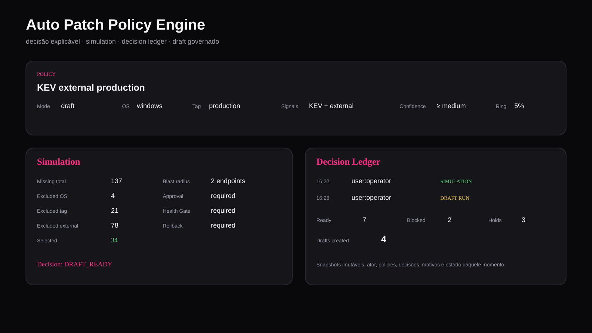

# Be Safe Patch Manager

Patch management **agent-based para Windows e Linux** com inventário, patch intelligence, priorização por risco, campanhas governadas, rollout progressivo, health gates, soak, regression intelligence, rollback protegido e evidência operacional.

> **Status:** MVP / laboratório.  
> **Control plane:** v0.38.0  
> **Agente:** v0.16.0  
> A base já executa patching real, mas ainda exige validação em laboratório antes de uso em produção.


> As imagens deste README são renders fiéis dos componentes e labels da interface real da `main`, preenchidos com dados demonstrativos para mostrar o produto em uso.

## Visão geral

O Be Safe Patch Manager não foi desenhado como um simples "listar updates e clicar em instalar".

A plataforma conecta:

- inventário e heartbeat dos endpoints;
- scan de patches;
- vulnerability management;
- threat intelligence;
- Patch Catalog;
- risk-based remediation;
- Auto Patch Policy;
- Patch Guard;
- Approval Gate;
- Change Freeze;
- rollout por rings;
- health gate;
- soak;
- regression intelligence;
- rollback;
- evidência pós-patch;
- auditoria.

O objetivo é responder não só **"qual patch está faltando?"**, mas também:

- em quais ativos;
- com qual contexto de risco;
- se a patch é realmente a melhor versão a implantar;
- qual blast radius inicial;
- se existe bloqueio operacional;
- se o ring atual piorou comparado ao anterior;
- por que promover, esperar ou pausar.

## Principais capacidades

### Patch Intelligence

O Patch Catalog consolida patches observadas pelos agentes e mantém:

- `missing`, `installed_inferred` e `no_longer_reported`;
- vendor e produto;
- release date;
- classificação;
- EOL;
- CVEs relacionadas;
- Patch Confidence;
- Patch Guard;
- deployment readiness;
- provenance campo a campo;
- metadata stale;
- supersedence graph;
- preferred replacement;
- Patch Tuesday intelligence.

A metadata pode vir de:

- feed `curated`;
- Microsoft Security Update Guide / CVRF v3;
- Ubuntu Security API.

O Patch Feed Orchestrator mantém:

- prioridade por provider;
- TTL;
- scheduling;
- ETag / Last-Modified;
- último sucesso/erro;
- failure counter;
- circuit breaker;
- sync manual e automático.

## Auto Patch Policy Engine



Policies podem operar em:

- `recommend`;
- `draft`.

Nesta versão **não existe auto-deploy**.

Uma policy pode considerar:

- KEV;
- exposição externa;
- Patch Tuesday;
- OS;
- tag;
- quantidade mínima de endpoints;
- confidence mínima;
- EOL;
- supersedence.

Regras importantes:

- **KEV + external** pode forçar canary de até 5%;
- Patch Tuesday pode limitar o rollout inicial a 10%;
- confidence abaixo do floor gera `HOLD`;
- EOL é bloqueado por padrão;
- patch superseded pode ser `replace`, `skip` ou `allow`;
- replacement só é usado quando a leaf está observada como aplicável/missing;
- Patch Guard e Change Freeze bloqueiam antes do draft;
- Approval Gate, Health Gate e rollback são herdados pela campanha.

### Simulation

A simulação mostra o funil real do escopo:

```text
missing total
  -> excluídos por OS
  -> excluídos por tag
  -> excluídos por exposição
  -> selecionados
```

Também expõe:

- blast radius;
- quantidade real do ring inicial;
- preconditions;
- confidence;
- EOL;
- KEV;
- motivo da decisão.

### Decision Ledger

Cada avaliação explícita gera um snapshot imutável com:

- ator;
- timestamp;
- modo;
- policies avaliadas;
- decisões;
- ready;
- blocked;
- holds;
- drafts criados;
- razões daquele momento.

Assim o histórico consegue responder:

> por que esta patch estava READY ontem?

sem recalcular a resposta com os dados de hoje.

## Progressive Rollout Governance


Cada campanha pode carregar um plano próprio, por exemplo:

```text
5 -> 10 -> 30 -> 100
```

ou:

```text
10 -> 25 -> 50 -> 100
```

Parâmetros:

- `rollout_plan`;
- `soak_minutes`;
- `promotion_min_success_rate`;
- `promotion_max_success_drop`;
- `pause_on_failure`.

Estados possíveis:

- `DRAFT`;
- `RUNNING`;
- `SOAK`;
- `PROMOTE`;
- `PAUSE`;
- `COMPLETE`.

Se o plano foi explicitamente configurado, o próximo ring é governado por ele.

Campanhas antigas sem plano explícito continuam compatíveis com o comportamento legado.

## Regression Intelligence + Safe Promotion

O health gate responde:

> este ring está saudável isoladamente?

A Regression Intelligence responde:

> este ring piorou em relação ao ring anterior?

A comparação usa evidências reais do rollout:

- success rate;
- failure rate;
- falhas de validação pós-patch;
- duração média dos jobs observados.

Estados:

- `NO_BASELINE`;
- `STABLE`;
- `REGRESSION`.

A recomendação de Safe Promotion pode ser:

- `PROMOTE`;
- `PAUSE`;
- `WAIT`;
- `COMPLETE`;
- `REVIEW`.

Exemplo:

```text
ring anterior: 100% success
ring atual:     91% success
mínimo absoluto: 90%
queda permitida: 5 p.p.

queda observada: 9 p.p.
=> REGRESSION
=> PAUSE
```

Mesmo que o threshold absoluto ainda esteja atendido, a deterioração relativa pode impedir promoção.

Cada deploy inicial e cada promoção de ring ficam registrados com:

- ator;
- ring anterior;
- ring seguinte;
- decisão;
- motivo;
- snapshot do health gate;
- timestamp.

## Risk-Based Remediation


A camada de risco inclui:

- CVSS;
- EPSS;
- CISA KEV;
- ransomware known;
- idade;
- SLA;
- criticidade;
- exposição externa;
- controles compensatórios;
- risk appetite;
- owner;
- business service;
- environment.

A plataforma mantém:

- Finding Risk explicável;
- Asset Risk 0–1000;
- histórico de Asset Risk;
- Risk Acceptance;
- Treatment Plan;
- Risk Reduction Simulation;
- Risk Reduction Opportunities;
- Risk Reduction Plan;
- Risk Reduction Goals;
- Remediation Hub;
- Remediation Projects;
- Active Threat Watch;
- Remediation Performance;
- Risk Program Overview.

Não existe score composto oculto para decidir promoção de patch.

A referência completa do modelo de risco está em [docs/risk-model.md](docs/risk-model.md).

## Execuções, Health Gate e Rollback


O agente pode coletar baseline imediatamente antes do patch e comparar depois:

- CPU;
- memória;
- espaço livre em disco;
- serviços críticos;
- checks HTTP(S) locais.

O health gate pode operar em modo fail-closed quando telemetria é obrigatória.

Rollback:

- checkpoint antes do patch, quando suportado;
- aprovação manual;
- motivo obrigatório;
- novo job auditável;
- sem rollback silencioso.

## Change Governance

### Patch Guard

Bloqueia uma patch reference:

- globalmente;
- por SO;
- por tag.

Deploy e avanço de ring falham antes de criar jobs quando uma regra ativa casa com o escopo.

### Approval Gate

Campanhas podem exigir aprovação administrativa.

Existe segregação de função:

> quem solicitou a campanha protegida não pode aprovar a própria mudança.

### Change Freeze / Blackout Calendar

Bloqueia deploy e promoção dentro de janelas ativas.

Emergency override:

- exige admin;
- exige justificativa;
- é específico da campanha;
- pode ser revogado;
- fica auditado.

## Arquitetura


Componentes principais:

- FastAPI;
- PostgreSQL;
- Alembic;
- agente Python;
- NGINX;
- Prometheus;
- Grafana;
- Greenbone/GMP opcional;
- feeds oficiais Microsoft/Ubuntu;
- CISA KEV;
- FIRST EPSS.

O Docker Compose usa PostgreSQL por padrão.

SQLite continua disponível para desenvolvimento/testes.

## Agentes

### Windows

- Windows Update Agent via COM;
- patch scan;
- instalação de updates;
- health telemetry;
- rollback checkpoint quando suportado;
- staging assinado de update do próprio agente.

### Linux

- `apt`;
- `dnf`;
- `yum`;
- patch scan;
- instalação;
- health telemetry;
- ativação segura de agent release assinada.

Cada agente reporta:

- versão;
- protocolo;
- capabilities;
- inventário;
- patches;
- heartbeat;
- estado de update;
- capacidade de rollback.

Ações em allowlist:

- `scan_updates`;
- `install_updates`;
- `rollback_checkpoint`;
- `activate_agent_update`.

**Não existe shell remoto arbitrário.**

## Quick start

### Servidor

Pré-requisitos:

- Docker;
- Docker Compose.

```bash
cp .env.example .env
```

Gere segredos fortes:

```bash
python3 - <<'PY'
import secrets
print("BOOTSTRAP_ADMIN_PASSWORD=" + secrets.token_urlsafe(32))
print("ENROLLMENT_TOKEN=" + secrets.token_urlsafe(48))
print("POSTGRES_PASSWORD=" + secrets.token_urlsafe(48))
PY
```

Defina também:

```dotenv
BOOTSTRAP_ADMIN_USERNAME=admin
```

Laboratório:

```bash
docker compose up -d --build
docker compose ps
```

Backend local:

```text
http://127.0.0.1:8080
```

Produção com HTTPS/mTLS:

```bash
docker compose -f docker-compose.yml -f docker-compose.prod.yml up -d --build
```

### Agente Linux

```bash
sudo ./deploy/install-linux.sh https://patch.seudominio.local piloto
```

### Agente Windows

PowerShell como Administrador:

```powershell
Set-ExecutionPolicy -Scope Process Bypass

.\deploy\windows\install-agent.ps1 `
  -ServerUrl "https://patch.seudominio.local" `
  -Tags @("piloto")
```

## Autenticação e RBAC

Perfis:

- `viewer`: leitura;
- `operator`: operação de campanhas, tags, vulnerabilidades, sync e avaliações;
- `admin`: usuários, approvals, rollback, retries e controles administrativos.

Senhas usam Argon2.

Sessões humanas:

- opacas;
- server-side;
- token armazenado somente em hash;
- mantidas somente em memória no navegador.

## Segurança

Já implementado:

- RBAC;
- Argon2;
- credencial individual por agente;
- enrollment token descartado após registro;
- allowlist de ações;
- job lease;
- claim token efêmero;
- resultados idempotentes;
- retry manual de jobs `stalled`;
- HTTPS;
- mTLS no overlay de produção;
- fingerprint vinculado ao agent_id;
- Patch Guard;
- Approval Gate;
- Change Freeze;
- health gate;
- rollback approval;
- signed agent releases com Ed25519;
- SHA-256;
- anti-downgrade;
- quarantine após watchdog rollback;
- PostgreSQL;
- Alembic;
- audit trail;
- pre-publish security check.

Para produção ainda são recomendados:

- testes reais Windows/Linux;
- HA;
- storage off-host para backup;
- rate limiting;
- SSO/federação opcional;
- hardening do host;
- Authenticode/EV caso o agente seja empacotado como EXE/MSI.

Leia também [SECURITY.md](SECURITY.md).

## Self-update assinado do agente

A release do agente usa Ed25519.

A chave privada deve ficar offline, em HSM ou cofre de CI.

Gerar par:

```bash
python scripts/agent-release.py generate-key \
  --private-key /caminho-seguro/agent-update-private.pem \
  --public-key /caminho-seguro/agent-update-public.pem
```

Build:

```bash
python scripts/agent-release.py build \
  --private-key /caminho-seguro/agent-update-private.pem \
  --output releases \
  --version 0.16.0 \
  --source-commit "$(git rev-parse HEAD)"
```

Verify:

```bash
python scripts/agent-release.py verify \
  --public-key deploy/update-trust/agent-update-public.pem \
  --release-dir releases
```

A assinatura Ed25519 protege o pacote e o manifest do update.

Ela **não substitui Authenticode/EV Code Signing** de um EXE/MSI Windows.

## HTTPS e mTLS

Produção:

```bash
docker compose -f docker-compose.yml -f docker-compose.prod.yml up -d --build
```

Arquivos esperados fora do Git:

```text
deploy/nginx/tls/server.crt
deploy/nginx/tls/server.key
deploy/nginx/tls/agent-ca.crt
```

As rotas de agente exigem certificado cliente válido no overlay de produção.

## Backup e restore

Backup:

```bash
./scripts/backup-postgres.sh
```

Restore:

```bash
CONFIRM_RESTORE=YES ./scripts/restore-postgres.sh backups/patchmgr-YYYYMMDDTHHMMSSZ.dump
```

O CI executa restore drill real em PostgreSQL.

## Observabilidade

Endpoints:

```text
GET /health
GET /ready
GET /metrics
```

Arquivos:

```text
deploy/prometheus/scrape.example.yml
deploy/prometheus/patch-manager.rules.yml
deploy/grafana/patch-manager-overview.json
```

As métricas são agregadas e evitam labels de alta cardinalidade com hostname, IP, usuário ou CVE.

## CI

O pipeline valida:

- Python syntax;
- signed release drill;
- Alembic em PostgreSQL real;
- backup/restore drill;
- unit tests;
- Docker Compose;
- Shell;
- PowerShell;
- NGINX;
- Prometheus;
- Grafana;
- JavaScript;
- pre-publish security check.

A v0.38 passou o pipeline completo.

## Estrutura

```text
be-safe-patch-manager/
├── docker-compose.yml
├── docker-compose.prod.yml
├── .env.example
├── README.md
├── SECURITY.md
├── CHANGELOG.md
├── docs/
│   ├── risk-model.md
│   └── images/
│       ├── dashboard-overview.svg
│       ├── dashboard-executions.svg
│       ├── auto-patch-policy.svg
│       ├── architecture-overview.svg
│       ├── secure-rollout-flow.svg
│       └── risk-reduction-features.svg
├── scripts/
├── releases/
├── server/
│   ├── alembic/
│   ├── tests/
│   └── app/
│       ├── main.py
│       ├── patch_feed_adapters.py
│       ├── observability.py
│       ├── agent_updates.py
│       ├── greenbone.py
│       ├── database.py
│       ├── models.py
│       ├── schemas.py
│       ├── security.py
│       └── static/
│           ├── index.html
│           ├── style.css
│           └── app.js
├── agent/
└── deploy/
```

## Roadmap

Próximas evoluções naturais:

- patching de aplicações de terceiros;
- ingestão adicional de CVEs;
- integração ITSM/SOAR;
- relatórios exportáveis;
- testes de integração reais em endpoints Windows/Linux;
- ativação segura equivalente do agente no Windows;
- HA e recuperação completa periódica.

## Licença

Consulte [LICENSE](LICENSE).
